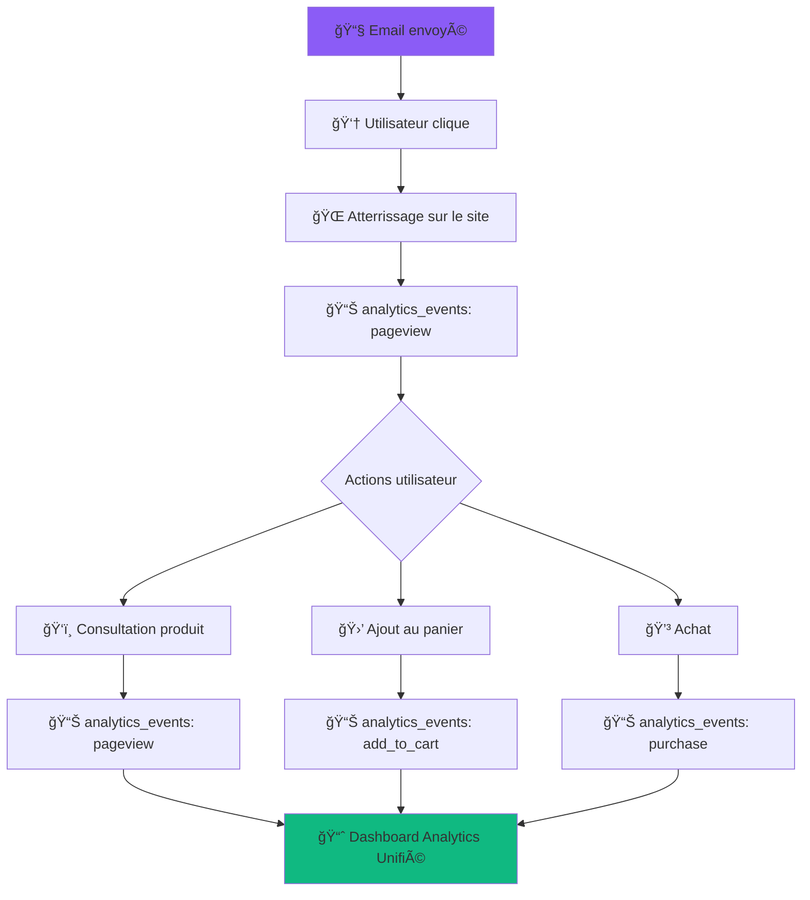

# 📧 Module de Gestion des Newsletters - Spécifications Fonctionnelles

Basé sur l'architecture existante de votre projet (Next.js 15, Supabase, système analytics déjà en place), voici une proposition complète des fonctionnalités possibles pour un module de newsletters performant et intégré.

---

## 🯠Fonctionnalités Principales

### 1. **Gestion des Abonnés** 👥

#### Features Core

- ✅ **Inscription newsletter** (footer site + popup intention de sortie)
- ✅ **Double opt-in** (email de confirmation obligatoire RGPD)
- ✅ **Désabonnement en 1 clic** (lien dans chaque email)
- ✅ **Gestion des préférences** (fréquence, types de contenus)
- ✅ **Import/Export CSV** des contacts
- ✅ **Suppression RGPD** (droit à l'oubli automatique)

#### Segmentation Avancée

- 📊 **Segments dynamiques** :
  - Par comportement (a acheté / n'a jamais acheté)
  - Par engagement (taux d'ouverture > 30%)
  - Par panier moyen (< 50€ / > 100€)
  - Par dernière visite (< 7 jours / > 30 jours)
  - Par produits consultés/wishlist
  - Par localisation (France / International)
- 🨠**Tags personnalisés** :
  - VIP / Fidèle / Prospect / Inactif
  - Fan de hauts / Fan de bas / Fan d'accessoires
  - Early adopter / Sensible aux promotions

#### Statuts des Abonnés

typescript

```typescript
typeSubscriberStatus=
|'pending'// En attente de confirmation
|'active'// Abonné actif
|'unsubscribed'// Désabonné
|'bounced'// Email invalide
|'complained'// Marqué comme spam
```

---

### 2. **Création & Envoi de Campagnes** 📨

#### Éditeur de Newsletter

- ✅ **Templates préconçus** style Jacquemus (minimalistes, élégants)
- ✅ **Éditeur WYSIWYG** (drag & drop de blocs)
- ✅ **Blocs disponibles** :
  - Hero avec image + CTA
  - Grille produits (2, 3 ou 4 colonnes)
  - Produit unique mis en avant
  - Texte enrichi (titres, paragraphes, citations)
  - Bouton CTA personnalisable
  - Séparateur / Spacer
  - Image pleine largeur
  - Réseaux sociaux

#### Variables Dynamiques

handlebars

```handlebars
{{first_name}}
→ Prénom du destinataire
{{last_viewed_product}}
→ Dernier produit consulté
{{cart_items}}
→ Articles dans le panier
{{recommended_products}}
→ Recommandations AI
{{discount_code}}
→ Code promo unique
```

#### Personnalisation Avancée

- 🯠**Contenu conditionnel** :

```
  Si panier abandonné → Afficher rappel panier
  Si jamais acheté → Offre -10% première commande
  Si VIP → Accès exclusif nouvelle collection
```

#### Planification & Envoi

- 📅 **Envoi immédiat** ou **programmé**
- 🔄 **Envoi récurrent** (hebdomadaire/mensuel)
- 🲠**Tests A/B** (2 versions, meilleure performance auto-envoyée)
- 📧 **Email de test** avant envoi massif
- 🚦 **Envoi progressif** (batches de 100/500/1000 pour éviter spam)

---

### 3. **Automatisations** 🤖

#### Scénarios Prédéfinis

typescript

```typescript
// 1. Bienvenue nouvel abonné
Trigger:Confirmation email → Wait 2h → Send welcome email

// 2. Panier abandonné (intégré analytics existant)
Trigger: add_to_cart event → No purchase 24h → Send reminder
         → No purchase 72h → Send-10% code

// 3. Relance post-achat
Trigger: purchase event → Wait7 days → Send satisfaction survey
         → Wait30 days → Send"Vous aimerez aussi"

// 4. Réactivation inactifs
Trigger:No visit 60 days → Send"Nous vous manquons ?"
         → No visit 90 days → Send"Last chance -15%"

// 5. Wishlist reminder
Trigger:Product added to wishlist → Wait3 days → Send reminder
         → Price drop detected → Send alert immediately

// 6. Retour en stock
Trigger:Product back in stock → Send to waitlist

// 7. Anniversaire
Trigger:Birthday date → Send-20% code

// 8. VIP anniversaire client
Trigger:1 year since first purchase → Send thank you gift

// 9. Cross-sell post-achat
Trigger: purchase "robe" → Suggest"accessoires"

// 10. Récupération des churned
Trigger:Active → Unsubscribed → Wait90 days → Send win-back
```

#### Conditions Avancées

- ✅ Délais entre emails (min 24h)
- ✅ Limites d'envoi (max 3/semaine)
- ✅ Stop si objectif atteint (ex: a acheté)
- ✅ Branchements conditionnels (si clique → envoi B, sinon → envoi C)

---

### 4. **Tracking & Analytics** 📊

#### Métriques par Campagne

typescript

```typescript
interfaceCampaignStats{
// Envoi
  sent:number// Emails envoyés
  delivered:number// Emails délivrés
  bounced:number// Emails rejetés
  delivery_rate:number// % délivrés

// Engagement
  opened:number// Ouvertures uniques
  open_rate:number// % ouvertures
  clicked:number// Clics uniques
  click_rate:number// % clics
  click_to_open_rate:number// CTOR

// Désabonnements
  unsubscribed:number// Désabonnés
  unsubscribe_rate:number// % désabonnés
  complained:number// Marqués spam

// E-commerce (intégration analytics)
  visits:number// Visites générées
  add_to_cart:number// Ajouts panier
  purchases:number// Achats générés
  revenue:number// CA généré
  conversion_rate:number// % conversion
  avg_order_value:number// Panier moyen
  roi:number// Retour sur investissement
}
```

#### Tracking Liens (UTM)

typescript

```typescript
// Génération automatique des liens trackés
const link = generateNewsletterLink({
  productId: 'uuid-robe-noire',
  campaignId: 'campaign-123',
  recipientId: 'recipient-456',
})

// Résultat :
// https://blancherenaudin.com/product/uuid-robe-noire?
//   utm_source=newsletter
//   &utm_medium=email
//   &utm_campaign=campaign-123
//   &utm_content=recipient-456
```

#### Heatmap des Clics

- ğŸ–±ï¸ Visualisation des zones cliquées dans l'email
- 🆠Classement des liens les plus performants
- 📠Identification des CTAs efficaces

#### Rapports Détaillés

- 📈 **Évolution temporelle** (ouvertures/clics par heure/jour)
- 🌠**Géolocalisation** (où vos emails sont ouverts)
- 📱 **Devices** (mobile 60% / desktop 40%)
- 📧 **Clients email** (Gmail 45% / Apple Mail 30% / Outlook 15%)
- 🔗 **Chemins de conversion** (email → page → panier → achat)

---

### 5. **Tableaux de Bord** 📊

#### Dashboard Global

```
┌─────────────────────────────────────────────────────────────â”
│  📧 OVERVIEWNEWSLETTERS(30 derniers jours)                │
├─────────────────────────────────────────────────────────────┤
│  Abonnés actifs      │  Emails envoyés  │  Taux d'ouverture │
│       2,847          │      12,450      │       28.5%       │
├─────────────────────────────────────────────────────────────┤
│  Taux de clic        │  Désabonnements  │  CA généré        │
│       8.2%           │        47        │    4,250€         │
└─────────────────────────────────────────────────────────────┘

📈 Évolution des abonnés(7 derniers jours)
   â–▂▃▅▇█ +142 nouveaux abonnés

🆠Top5Campagnes
1."Nouvelle Collection Hiver"-35% open,2,450€
2."Flash Sale -20%"-42% open,1,890€
3."Back in Stock : Robe Noire"-31% open,980€
...
```

#### Dashboard par Campagne

- 📊 Graphiques interactifs (Recharts)
- 📋 Liste des destinataires avec statuts individuels
- 🔠Filtres avancés (a ouvert / a cliqué / a acheté)
- 💾 Export des données

---

### 6. **Intégration E-commerce** ğŸ›ï¸

#### Synchronisation Automatique

- ✅ **Nouveaux clients** → Ajout automatique à la newsletter (opt-in)
- ✅ **Commandes** → Tag "Client" + retrait du segment "Prospect"
- ✅ **Wishlist** → Trigger automatisation retour en stock
- ✅ **Panier abandonné** → Récupération UTM campaign pour attribution

#### Blocs Produits Dynamiques

typescript

```typescript
// Dans l'éditeur de newsletter
<ProductBlock
  source="manual"// Sélection manuelle
  productIds={['uuid1','uuid2']}
/>

<ProductBlock
  source="top_sellers"// 3 meilleures ventes
  limit={3}
/>

<ProductBlock
  source="new_arrivals"// Nouveautés
  limit={4}
/>

<ProductBlock
  source="personalized"// Basé sur l'historique
  userId={recipient.id}
  limit={3}
/>

<ProductBlock
  source="cart_recovery"// Articles du panier
  userId={recipient.id}
/>
```

#### Attribution des Ventes

sql

```sql
-- Lier une commande à une campagne newsletter
SELECT
  o.order_number,
  o.total_amount,
  ae.utm_campaign AS newsletter_campaign,
  nc.campaign_name
FROM orders o
JOIN analytics_events ae ON ae.session_id = o.session_id
JOIN newsletter_campaigns nc ON nc.utm_campaign = ae.utm_campaign
WHERE ae.utm_source ='newsletter'
AND o.created_at >= nc.sent_at
AND o.created_at <= nc.sent_at +INTERVAL'7 days'
```

---

### 7. **Conformité RGPD** 🔒

#### Fonctionnalités Légales

- ✅ **Double opt-in obligatoire** (proof of consent)
- ✅ **Lien désabonnement** dans chaque email (footer)
- ✅ **Centre de préférences** (fréquence, contenus)
- ✅ **Export des données** (droit d'accès)
- ✅ **Suppression définitive** (droit à l'oubli)
- ✅ **Logs de consentement** (date/heure/IP/source)
- ✅ **Politique de confidentialité** (intégrée au formulaire)

#### Textes Légaux

typescript

```typescript
// Lors de l'inscription
"En vous abonnant, vous acceptez de recevoir nos newsletters
et offres exclusives.Vous pouvez vous désabonner à tout moment
via le lien présent dans chaque email.Vos données sont
traitées conformément à notre [Politique de confidentialité]."
```

---

### 8. **Templates & Design** ğŸ¨

#### Templates Pré-conçus

1. **Minimaliste Jacquemus** (style actuel du site)
   - Header épuré avec logo
   - Grande image hero
   - Texte centré, tracking large
   - CTA minimaliste
   - Footer avec réseaux sociaux
2. **Grille Produits** (2/3/4 colonnes)
   - Images produits carrées
   - Nom + prix
   - CTA "Découvrir"
3. **Produit Unique** (mise en avant)
   - Grande image produit
   - Description détaillée
   - CTA proéminent
4. **Story-telling** (éditorial)
   - Texte long format
   - Images illustratives
   - Ambiance marque
5. **Flash Sale** (urgence)
   - Compteur dégressif
   - Code promo visible
   - Couleurs contrastées

#### Personnalisation

- 🨠**Couleurs** : Violet principal + niveaux de gris
- 🔤 **Fonts** : Archivo Black + Archivo Narrow (cohérence site)
- 📠**Responsive** : Mobile-first (60% des ouvertures)
- ⚡ **Performances** : Images optimisées, HTML léger

---

### 9. **Intégration Service Email** 📮

#### Options Recommandées

**Option 1 : Resend** (⭠Recommandé pour ce projet)

typescript

```typescript
// Déjà partiellement configuré dans le projet
import { Resend } from 'resend'

const resend = newResend(process.env.RESEND_API_KEY)

// Avantages :
// ✅ API simple et moderne
// ✅ Templates React (cohérence avec le projet)
// ✅ 100 emails/jour gratuits
// ✅ Analytics inclus
// ✅ Webhooks pour tracking
```

**Option 2 : SendGrid**

typescript

```typescript
// Alternative si volumes élevés
// ✅ 100 emails/jour gratuits
// ✅ Deliverability excellente
// ✅ Templates HTML
```

**Option 3 : Mailchimp** (si besoin features avancées)

typescript

```typescript
// ✅ Éditeur drag & drop intégré
// ✅ Automatisations avancées
// ✅ Segmentation puissante
// âš ï¸ Plus cher, moins intégré au code
```

#### Webhooks & Événements

typescript

```typescript
// Recevoir les événements de Resend
POST/api/webhooks/resend

Events disponibles :
- email.sent
- email.delivered
- email.delivery_delayed
- email.bounced
- email.opened
- email.clicked
- email.complained(spam)
- email.unsubscribed
```

---

### 10. **Tests & Optimisation** 🧪

#### Tests A/B

typescript

```typescript
interfaceABTest{
  name:string
  variants:[
{
      name:'A - Original',
      subject:'Nouvelle Collection Hiver â„ï¸',
      percentage:50
},
{
      name:'B - Urgence',
      subject:'Dernières pièces disponibles !',
      percentage:50
}
]
  metric:'open_rate'|'click_rate'|'conversion_rate'
  winner:'auto'|'manual'
  sample_size:1000// Tester sur 1000 abonnés
}
```

#### Tests de Délivrabilité

- 📧 **Spam Score** (avant envoi)
- 🔠**Prévisualisation** (Gmail, Outlook, Apple Mail)
- 📱 **Responsive Test** (mobile, desktop, tablette)
- 🔗 **Link Checker** (tous les liens fonctionnent)
- ğŸ–¼ï¸ **Image Checker** (images chargent correctement)

#### Optimisations Automatiques

- Ⱐ**Send Time Optimization** : Envoi à l'heure optimale par abonné
- 📊 **Content Optimization** : Suggestions basées sur performances passées
- 🯠**Audience Optimization** : Exclusion des inactifs

---

## ğŸ—‚ï¸ Structure Base de Données Proposée

sql

```sql
-- Table des abonnés
CREATETABLE newsletter_subscribers (
  id UUID PRIMARYKEYDEFAULT gen_random_uuid(),
  email TEXTUNIQUENOTNULL,
  first_name TEXT,
  last_name TEXT,
statusTEXTNOTNULLCHECK(statusIN('pending','active','unsubscribed','bounced','complained')),

-- Segmentation
  tags TEXT[],
  segments TEXT[],

-- Métriques
  total_opens INTDEFAULT0,
  total_clicks INTDEFAULT0,
  last_opened_at TIMESTAMPTZ,
  last_clicked_at TIMESTAMPTZ,

-- E-commerce
  total_purchases INTDEFAULT0,
  total_revenue DECIMAL(10,2)DEFAULT0,
  last_purchase_at TIMESTAMPTZ,

-- RGPD
  consent_given_at TIMESTAMPTZ NOTNULL,
  consent_ip TEXT,
  consent_source TEXT,
  unsubscribed_at TIMESTAMPTZ,

-- Métadonnées
  created_at TIMESTAMPTZ DEFAULTNOW(),
  updated_at TIMESTAMPTZ DEFAULTNOW()
);

-- Table des campagnes
CREATETABLE newsletter_campaigns (
  id UUID PRIMARYKEYDEFAULT gen_random_uuid(),
  name TEXTNOTNULL,
  subject TEXTNOTNULL,
  preview_text TEXT,

-- Contenu
  html_content TEXTNOTNULL,
  template_id UUID REFERENCES newsletter_templates(id),

-- Ciblage
  segment_ids UUID[],
  recipient_count INT,

-- Planification
statusTEXTNOTNULLCHECK(statusIN('draft','scheduled','sending','sent','cancelled')),
  scheduled_at TIMESTAMPTZ,
  sent_at TIMESTAMPTZ,

-- Tracking
  utm_campaign TEXTUNIQUENOTNULL,

-- Métriques (calculées)
  sent INTDEFAULT0,
  delivered INTDEFAULT0,
  bounced INTDEFAULT0,
  opened INTDEFAULT0,
  clicked INTDEFAULT0,
  unsubscribed INTDEFAULT0,
  complained INTDEFAULT0,

-- E-commerce (jointure avec analytics_events)
  visits INTDEFAULT0,
  add_to_cart INTDEFAULT0,
  purchases INTDEFAULT0,
  revenue DECIMAL(10,2)DEFAULT0,

  created_at TIMESTAMPTZ DEFAULTNOW(),
  updated_at TIMESTAMPTZ DEFAULTNOW()
);

-- Table des envois individuels (pour tracking détaillé)
CREATETABLE newsletter_sends (
  id UUID PRIMARYKEYDEFAULT gen_random_uuid(),
  campaign_id UUID NOTNULLREFERENCES newsletter_campaigns(id),
  subscriber_id UUID NOTNULLREFERENCES newsletter_subscribers(id),

-- Statut
statusTEXTNOTNULLCHECK(statusIN('pending','sent','delivered','bounced','opened','clicked','unsubscribed','complained')),

-- Événements
  sent_at TIMESTAMPTZ,
  delivered_at TIMESTAMPTZ,
  first_opened_at TIMESTAMPTZ,
  last_opened_at TIMESTAMPTZ,
  first_clicked_at TIMESTAMPTZ,
  last_clicked_at TIMESTAMPTZ,
  opens_count INTDEFAULT0,
  clicks_count INTDEFAULT0,

-- Erreurs
  bounce_reason TEXT,
  complaint_reason TEXT,

  created_at TIMESTAMPTZ DEFAULTNOW()
);

-- Table des clics (détail des liens)
CREATETABLE newsletter_clicks (
  id UUID PRIMARYKEYDEFAULT gen_random_uuid(),
  send_id UUID NOTNULLREFERENCES newsletter_sends(id),
  link_url TEXTNOTNULL,
  clicked_at TIMESTAMPTZ DEFAULTNOW()
);

-- Table des templates
CREATETABLE newsletter_templates (
  id UUID PRIMARYKEYDEFAULT gen_random_uuid(),
  name TEXTNOTNULL,
  description TEXT,
  thumbnail_url TEXT,
  html_content TEXTNOTNULL,
  category TEXT,
  is_active BOOLEANDEFAULTtrue,
  created_at TIMESTAMPTZ DEFAULTNOW()
);

-- Table des automatisations
CREATETABLE newsletter_automations (
  id UUID PRIMARYKEYDEFAULT gen_random_uuid(),
  name TEXTNOTNULL,
  trigger_type TEXTNOTNULL,-- 'cart_abandoned', 'welcome', 'reactivation', etc.
  trigger_config JSONB NOTNULL,

-- Workflow
  steps JSONB NOTNULL,-- [{type: 'wait', duration: '2h'}, {type: 'email', template_id: 'uuid'}]

-- Statut
  is_active BOOLEANDEFAULTtrue,

-- Métriques
  triggered_count INTDEFAULT0,
  completed_count INTDEFAULT0,

  created_at TIMESTAMPTZ DEFAULTNOW(),
  updated_at TIMESTAMPTZ DEFAULTNOW()
);

-- Indexes
CREATEINDEX idx_subscribers_email ON newsletter_subscribers(email);
CREATEINDEX idx_subscribers_status ON newsletter_subscribers(status);
CREATEINDEX idx_campaigns_status ON newsletter_campaigns(status);
CREATEINDEX idx_campaigns_sent_at ON newsletter_campaigns(sent_at DESC);
CREATEINDEX idx_sends_campaign ON newsletter_sends(campaign_id);
CREATEINDEX idx_sends_subscriber ON newsletter_sends(subscriber_id);
CREATEINDEX idx_clicks_send ON newsletter_clicks(send_id);
```

---

## 📠Structure des Fichiers Proposée

```
src/
├── app/
│   ├── api/
│   │   └── admin/
│   │       └── newsletter/
│   │           ├── subscribers/
│   │           │   ├── route.ts              # CRUD abonnés
│   │           │   ├── [id]/route.ts         # Get/Update/Delete
│   │           │   ├── import/route.ts       # Import CSV
│   │           │   ├── export/route.ts       # Export CSV
│   │           │   └── segments/route.ts     # Gestion segments
│   │           │
│   │           ├── campaigns/
│   │           │   ├── route.ts              # CRUD campagnes
│   │           │   ├── [id]/
│   │           │   │   ├── route.ts          # Get/Update/Delete
│   │           │   │   ├── send/route.ts     # Envoyer
│   │           │   │   ├── schedule/route.ts # Planifier
│   │           │   │   ├── test/route.ts     # Envoi test
│   │           │   │   └── stats/route.ts    # Statistiques
│   │           │   └── templates/route.ts    # Liste templates
│   │           │
│   │           ├── automations/
│   │           │   ├── route.ts              # CRUD automatisations
│   │           │   └── [id]/
│   │           │       ├── route.ts
│   │           │       └── toggle/route.ts   # Activer/Désactiver
│   │           │
│   │           ├── stats/
│   │           │   ├── overview/route.ts     # Stats globales
│   │           │   └── performance/route.ts  # Top campagnes
│   │           │
│   │           └── webhooks/
│   │               └── resend/route.ts       # Webhooks Resend
│   │
│   ├── newsletter/
│   │   ├── subscribe/page.tsx                # Page abonnement publique
│   │   ├── unsubscribe/page.tsx              # Désabonnement
│   │   ├── preferences/page.tsx              # Centre préférences
│   │   └── confirm/page.tsx                  # Confirmation opt-in
│   │
│   └── admin/(protected)/
│       └── newsletter/
│           ├── page.tsx                      # Dashboard principal
│           │
│           ├── subscribers/
│           │   ├── page.tsx                  # Liste abonnés
│           │   ├── [id]/page.tsx             # Détail abonné
│           │   ├── import/page.tsx           # Import CSV
│           │   └── segments/page.tsx         # Gestion segments
│           │
│           ├── campaigns/
│           │   ├── page.tsx                  # Liste campagnes
│           │   ├── new/page.tsx              # Créer campagne
│           │   ├── [id]/
│           │   │   ├── page.tsx              # Éditer campagne
│           │   │   ├── editor/page.tsx       # Éditeur email
│           │   │   └── stats/page.tsx        # Stats campagne
│           │   └── templates/page.tsx        # Bibliothèque templates
│           │
│           └── automations/
│               ├── page.tsx                  # Liste automatisations
│               ├── new/page.tsx              # Créer automatisation
│               └── [id]/page.tsx             # Éditer automatisation
│
├── components/
│   └── newsletter/
│       ├── SubscribeForm.tsx                 # Formulaire abonnement
│       ├── editor/
│       │   ├── EmailEditor.tsx               # Éditeur drag & drop
│       │   ├── blocks/# Blocs disponibles
│       │   │   ├── HeroBlock.tsx
│       │   │   ├── ProductGridBlock.tsx
│       │   │   ├── TextBlock.tsx
│       │   │   ├── ButtonBlock.tsx
│       │   │   └── index.ts
│       │   └── preview/
│       │       ├── DesktopPreview.tsx
│       │       └── MobilePreview.tsx
│       │
│       ├── CampaignCard.tsx                  # Card campagne
│       ├── SubscriberCard.tsx                # Card abonné
│       ├── StatsOverview.tsx                 # Vue d'ensemble stats
│       └── SegmentBuilder.tsx                # Constructeur segments
│
└── lib/
    └── newsletter/
        ├── resend.ts                         # Client Resend
        ├── templates.tsx                     # Templates React
        ├── segments.ts                       # Logique segmentation
        ├── tracking.ts                       # Tracking UTM
        └── utils.ts                          # Helpers
```

---

## 🚀 Roadmap d'Implémentation

### Phase 1 : MVP (2-3 semaines) âš¡

1. ✅ Tables Supabase + RLS
2. ✅ Formulaire abonnement frontend
3. ✅ Double opt-in
4. ✅ Création campagne simple (texte + lien)
5. ✅ Envoi via Resend
6. ✅ Dashboard basique (nb abonnés, campagnes envoyées)
7. ✅ Tracking ouvertures/clics (webhooks Resend)
8. ✅ Désabonnement

### Phase 2 : Features Essentielles (2 semaines) ğŸ¯

9. ✅ Éditeur email (blocs produits, images, texte)
10. ✅ Templates pré-conçus style Jacquemus
11. ✅ Segmentation basique (clients/prospects)
12. ✅ Stats détaillées par campagne
13. ✅ Intégration avec analytics_events (attribution ventes)
14. ✅ Import/Export CSV

### Phase 3 : Automatisations (2 semaines) 🤖

15. ✅ Automatisation panier abandonné
16. ✅ Automatisation bienvenue
17. ✅ Automatisation retour en stock
18. ✅ Automatisation réactivation

### Phase 4 : Optimisations (1-2 semaines) 🚀

19. ✅ Tests A/B
20. ✅ Segmentation avancée
21. ✅ Heatmap des clics
22. ✅ Recommandations produits personnalisées

---

## 💡 Questions Ouvertes

1. **Volume d'envoi prévu** ?
   - < 1000 emails/mois → Resend gratuit suffit
   - > 10,000 emails/mois → Envisager SendGrid
2. **Fréquence des newsletters** ?
   - Hebdomadaire / Bi-mensuel / Événementiel uniquement ?
3. **Priorité sur les automatisations** ?
   - Panier abandonné est critique pour e-commerce
   - Bienvenue nouvel abonné améliore engagement
4. **Design des emails** ?
   - Templates fixes style Jacquemus
   - ou Éditeur flexible drag & drop ?
5. **Intégration avec le système analytics existant** ?
   - ✅ Déjà prévu : UTM + attribution ventes via analytics_events

---

**Souhaitez-vous que je détaille un aspect particulier ou que je commence par créer le schéma SQL complet + les premiers endpoints API ?** 🚀

Réessayer

TR

tu proposes un systeme tres complet de gestion d'emailing mais as tu prévu de mesurer la performance des cliqueurs jusqu'au panier en réutilisant notre systeme de tracking et compatible avec notre analytics, il faudrait que l'on soit cohérent entre les canaux pour l'analytics

# 📊 Intégration Newsletter → Analytics Unifié

Tu as **absolument raison** ! Le module newsletter doit s'intégrer parfaitement avec votre système de tracking existant pour avoir une vision cohérente cross-canal. Voici comment unifier tout ça.

---

## 🯠Architecture Unifiée de Tracking

### Flux Complet : Email → Site → Conversion

mermaid



---

## 🔗 Système UTM Unifié

### Structure des UTM pour Newsletter

typescript

```typescript
// lib/newsletter/tracking.ts

interfaceNewsletterUTMParams{
  source:'newsletter'// Toujours 'newsletter'
  medium:'email'// Toujours 'email'
  campaign:string// ID unique de la campagne
  content?:string// Bloc/lien spécifique dans l'email
  term?:string// Segment du destinataire (optionnel)
}

// Exemple de lien généré
functiongenerateNewsletterLink(params:{
  baseUrl:string
  campaignId:string
  subscriberId:string
  linkName?:string
}):string{
const url =newURL(params.baseUrl)

// UTM standards
  url.searchParams.set('utm_source','newsletter')
  url.searchParams.set('utm_medium','email')
  url.searchParams.set('utm_campaign', params.campaignId)

// Tracking détaillé
if(params.linkName){
    url.searchParams.set('utm_content', params.linkName)
}

// Identifiant abonné pour tracking individuel
  url.searchParams.set('subscriber', params.subscriberId)

return url.toString()
}

// Exemples de liens générés :
// https://blancherenaudin.com/products/hauts?
//   utm_source=newsletter
//   &utm_medium=email
//   &utm_campaign=newsletter-2025-01-hiver
//   &utm_content=hero-cta
//   &subscriber=abc-123

// https://blancherenaudin.com/product/robe-noire?
//   utm_source=newsletter
//   &utm_medium=email
//   &utm_campaign=newsletter-2025-01-hiver
//   &utm_content=product-grid-item-1
//   &subscriber=abc-123
```

### Cohérence avec les Autres Canaux

typescript

```typescript
// Tous les canaux utilisent la même structure UTM

// Instagram (déjà en place selon doc Social Media)
// utm_source=instagram&utm_medium=social&utm_campaign=story-collection-2025

// Newsletter (nouveau)
// utm_source=newsletter&utm_medium=email&utm_campaign=newsletter-2025-01-hiver

// Google Ads (futur)
// utm_source=google&utm_medium=cpc&utm_campaign=search-hauts-hiver

// Facebook (futur)
// utm_source=facebook&utm_medium=social&utm_campaign=carousel-nouvelle-collection
```

---

## 📊 Table `analytics_events` Étendue

### Champs Déjà Existants (selon Analytics_Custom_Doc.md)

sql

```sql
CREATETABLE analytics_events (
  id UUID PRIMARYKEYDEFAULT gen_random_uuid(),

-- Type d'événement
  event_type TEXTNOTNULL,-- 'pageview', 'add_to_cart', 'purchase', etc.

-- Page & Navigation
  page_path TEXT,
  page_title TEXT,
  referrer TEXT,

-- UTM Tracking (DÉJÀ EN PLACE ✅)
  utm_source TEXT,-- 'newsletter', 'instagram', 'google'
  utm_medium TEXT,-- 'email', 'social', 'cpc'
  utm_campaign TEXT,-- 'newsletter-2025-01-hiver'
  utm_content TEXT,-- 'hero-cta', 'product-grid-item-1'
  utm_term TEXT,-- (optionnel)

-- E-commerce
  product_id UUID,
  order_id UUID,
  revenue DECIMAL(10,2),
  cart_value DECIMAL(10,2),

-- Utilisateur
  user_id UUID,
  session_id TEXTNOTNULL,

-- Device & Browser
  device_type TEXT,
  browser TEXT,
  os TEXT,

-- Localisation
  country TEXT,
  city TEXT,

-- Propriétés custom (JSON)
  properties JSONB,

-- Timestamp
  created_at TIMESTAMPTZ DEFAULTNOW()
);

-- Index pour performance
CREATEINDEX idx_analytics_utm_source ON analytics_events(utm_source);
CREATEINDEX idx_analytics_utm_campaign ON analytics_events(utm_campaign);
CREATEINDEX idx_analytics_session ON analytics_events(session_id);
```

### Nouvelles Propriétés JSONB pour Newsletter

typescript

```typescript
// Pour les événements venant de newsletter
properties:{
// Newsletter spécifique
  subscriber_id:'uuid-subscriber',
  newsletter_campaign_id:'uuid-campaign',
  email_link_name:'hero-cta'|'product-grid-item-1'|'footer-instagram',

// Déjà existant pour autres canaux
  quantity?:number,
  size?:string,
  color?:string,
  items?:Array<{...}>
}
```

---

## 🔄 Flux de Tracking Complet

### 1. L'Utilisateur Clique dans l'Email

typescript

```typescript
// Dans le template d'email React (lib/newsletter/templates.tsx)

import{ generateNewsletterLink }from'@/lib/newsletter/tracking'

exportfunctionNewsletterTemplate({
  campaign,
  subscriber,
  products
}:NewsletterTemplateProps){
return(
<Html>
<Body>
{/* Hero CTA */}
<Button
          href={generateNewsletterLink({
            baseUrl:'https://blancherenaudin.com/products/hauts',
            campaignId: campaign.id,
            subscriberId: subscriber.id,
            linkName:'hero-cta'
})}
>
Découvrir la collection
</Button>

{/* Produit dans la grille */}
{products.map((product, index)=>(
<Link
            key={product.id}
            href={generateNewsletterLink({
              baseUrl:`https://blancherenaudin.com/product/${product.id}`,
              campaignId: campaign.id,
              subscriberId: subscriber.id,
              linkName:`product-grid-item-${index +1}`
})}
>

</Link>
))}
</Body>
</Html>
)
}
```

### 2. Atterrissage sur le Site

typescript

```typescript
// components/analytics/AnalyticsTracker.tsx (DÉJÀ EN PLACE ✅)

'use client'

import{ useEffect }from'react'
import{ usePathname, useSearchParams }from'next/navigation'
import{ trackPageView }from'@/lib/analytics'

exportfunctionAnalyticsTracker(){
const pathname =usePathname()
const searchParams =useSearchParams()

useEffect(()=>{
// Les UTM params sont automatiquement capturés
trackPageView(pathname)
},[pathname, searchParams])

returnnull
}
```

### 3. Extraction des UTM dans `lib/analytics.ts`

typescript

```typescript
// lib/analytics.ts (À ADAPTER)

exportasyncfunctiontrackPageView(pagePath:string){
// Récupérer les UTM params depuis l'URL
const searchParams =newURLSearchParams(window.location.search)

const utmSource = searchParams.get('utm_source')
const utmMedium = searchParams.get('utm_medium')
const utmCampaign = searchParams.get('utm_campaign')
const utmContent = searchParams.get('utm_content')
const utmTerm = searchParams.get('utm_term')
const subscriberId = searchParams.get('subscriber')

// Préparer les données
const eventData ={
    event_type:'pageview',
    page_path: pagePath,
    page_title:document.title,
    session_id:getOrCreateSessionId(),

// Device info (déjà existant)
...getDeviceInfo(),

// UTM params (✅ DÉJÀ EN PLACE)
    utm_source: utmSource,
    utm_medium: utmMedium,
    utm_campaign: utmCampaign,
    utm_content: utmContent,
    utm_term: utmTerm,

// Newsletter specific (dans properties)
    properties:{
...(subscriberId &&{ subscriber_id: subscriberId }),
...(utmContent &&{ email_link_name: utmContent })
}
}

// Envoyer à Supabase (Fire & Forget)
  supabase
.from('analytics_events')
.insert(eventData)
.catch(err =>console.debug('Analytics failed:', err))
}
```

### 4. Tracking des Actions E-commerce

typescript

```typescript
// store/useCartStore.ts (DÉJÀ EN PLACE avec tracking ✅)

// Lors d'un ajout au panier
addItem:(product, variant)=>{
// ... logique panier

// Track avec UTM automatiquement inclus
trackAddToCart(product.id, product.price, quantity)
}

// lib/analytics.ts
exportfunctiontrackAddToCart(
  productId:string,
  price:number,
  quantity:number
){
const searchParams =newURLSearchParams(window.location.search)

const eventData ={
    event_type:'add_to_cart',
    product_id: productId,
    cart_value: price * quantity,
    session_id:getOrCreateSessionId(),

// 🔥 Les UTM sont préservés tout au long de la navigation
    utm_source: searchParams.get('utm_source'),
    utm_medium: searchParams.get('utm_medium'),
    utm_campaign: searchParams.get('utm_campaign'),
    utm_content: searchParams.get('utm_content'),

    properties:{
      quantity,
      price,
      subscriber_id: searchParams.get('subscriber')
}
}

  supabase.from('analytics_events').insert(eventData)
}
```

### 5. Tracking de l'Achat Final

typescript

```typescript
// app/checkout/success/page.tsx ou webhook Stripe

exportfunctiontrackPurchaseCompleted(orderId:string, totalAmount:number){
// 🔥 Récupérer les UTM depuis la session ou l'order
const{ data: order }=await supabase
.from('orders')
.select('session_id, utm_campaign, utm_source, utm_medium')
.eq('id', orderId)
.single()

const eventData ={
    event_type:'purchase',
    order_id: orderId,
    revenue: totalAmount,
    session_id: order.session_id,

// 🯠Attribution à la newsletter
    utm_source: order.utm_source,// 'newsletter'
    utm_medium: order.utm_medium,// 'email'
    utm_campaign: order.utm_campaign,// 'newsletter-2025-01-hiver'

    properties:{
      items_count: order.items.length,
// ...
}
}

  supabase.from('analytics_events').insert(eventData)
}
```

---

## 📊 Vue Unifiée `newsletter_performance`

### Jointure Newsletter ↔ Analytics

sql

```sql
-- Créer une vue qui joint campagnes newsletter + analytics_events
CREATEVIEW newsletter_performance AS
SELECT
  nc.id,
  nc.name,
  nc.subject,
  nc.utm_campaign,
  nc.sent_at,

-- Métriques Email (depuis Resend webhooks)
  nc.sent,
  nc.delivered,
  nc.opened,
  nc.clicked,
  nc.open_rate,
  nc.click_rate,

-- Métriques Web (depuis analytics_events) 🔥
COUNT(DISTINCTCASE
WHEN ae.event_type ='pageview'
THEN ae.session_id
END)AS web_visits,

COUNT(DISTINCTCASE
WHEN ae.event_type ='pageview'
AND ae.page_path LIKE'/product/%'
THEN ae.session_id
END)AS product_views,

COUNT(DISTINCTCASE
WHEN ae.event_type ='add_to_cart'
THEN ae.session_id
END)AS add_to_cart_sessions,

COUNT(CASE
WHEN ae.event_type ='add_to_cart'
THEN1
END)AS add_to_cart_count,

COUNT(DISTINCTCASE
WHEN ae.event_type ='purchase'
THEN ae.order_id
END)AS purchases,

COALESCE(SUM(CASE
WHEN ae.event_type ='purchase'
THEN ae.revenue
END),0)AS revenue,

-- Métriques Calculées
CASE
WHENCOUNT(DISTINCTCASEWHEN ae.event_type ='pageview'THEN ae.session_id END)>0
THEN(COUNT(DISTINCTCASEWHEN ae.event_type ='purchase'THEN ae.order_id END)::NUMERIC
/COUNT(DISTINCTCASEWHEN ae.event_type ='pageview'THEN ae.session_id END)*100)
ELSE0
ENDAS conversion_rate,

CASE
WHENCOUNT(DISTINCTCASEWHEN ae.event_type ='purchase'THEN ae.order_id END)>0
THEN(COALESCE(SUM(CASEWHEN ae.event_type ='purchase'THEN ae.revenue END),0)
/COUNT(DISTINCTCASEWHEN ae.event_type ='purchase'THEN ae.order_id END))
ELSE0
ENDAS avg_order_value,

-- ROI (si vous avez un coût par email)
CASE
WHEN nc.cost >0
THEN((COALESCE(SUM(CASEWHEN ae.event_type ='purchase'THEN ae.revenue END),0)- nc.cost)
/ nc.cost *100)
ELSENULL
ENDAS roi_percentage

FROM newsletter_campaigns nc
LEFTJOIN analytics_events ae
ON ae.utm_campaign = nc.utm_campaign
AND ae.utm_source ='newsletter'
AND ae.utm_medium ='email'
AND ae.created_at >= nc.sent_at
AND ae.created_at <= nc.sent_at +INTERVAL'7 days'-- Attribution window

GROUPBY nc.id
ORDERBY nc.sent_at DESC;
```

---

## 🯠Funnel de Conversion Newsletter

### Vue Détaillée du Parcours

sql

```sql
-- Funnel détaillé : Email → Visite → Produit → Panier → Achat
CREATEVIEW newsletter_funnel AS
WITH campaign_sessions AS(
SELECTDISTINCT
    ae.utm_campaign,
    ae.session_id,
MIN(ae.created_at) FILTER (WHERE ae.event_type ='pageview')AS first_visit,
MAX(ae.created_at) FILTER (WHERE ae.event_type ='pageview'AND ae.page_path LIKE'/product/%')AS product_view,
MAX(ae.created_at) FILTER (WHERE ae.event_type ='add_to_cart')AS add_to_cart,
MAX(ae.created_at) FILTER (WHERE ae.event_type ='purchase')AS purchase,
MAX(ae.revenue) FILTER (WHERE ae.event_type ='purchase')AS purchase_amount
FROM analytics_events ae
WHERE ae.utm_source ='newsletter'
AND ae.utm_medium ='email'
AND ae.utm_campaign ISNOTNULL
GROUPBY ae.utm_campaign, ae.session_id
)
SELECT
  nc.id,
  nc.name,
  nc.utm_campaign,

-- Étape 1 : Email ouvert
  nc.opened AS step1_opened,

-- Étape 2 : Clic dans l'email
  nc.clicked AS step2_clicked,

-- Étape 3 : Visite site
COUNT(DISTINCT cs.session_id)AS step3_visited,

-- Étape 4 : Vue produit
COUNT(DISTINCT cs.session_id) FILTER (WHERE cs.product_view ISNOTNULL)AS step4_product_view,

-- Étape 5 : Ajout panier
COUNT(DISTINCT cs.session_id) FILTER (WHERE cs.add_to_cart ISNOTNULL)AS step5_add_to_cart,

-- Étape 6 : Achat
COUNT(DISTINCT cs.session_id) FILTER (WHERE cs.purchase ISNOTNULL)AS step6_purchase,

-- Taux de passage
ROUND((COUNT(DISTINCT cs.session_id)::NUMERIC/NULLIF(nc.clicked,0)*100),2)AS click_to_visit_rate,
ROUND((COUNT(DISTINCT cs.session_id) FILTER (WHERE cs.product_view ISNOTNULL)::NUMERIC/NULLIF(COUNT(DISTINCT cs.session_id),0)*100),2)AS visit_to_product_rate,
ROUND((COUNT(DISTINCT cs.session_id) FILTER (WHERE cs.add_to_cart ISNOTNULL)::NUMERIC/NULLIF(COUNT(DISTINCT cs.session_id) FILTER (WHERE cs.product_view ISNOTNULL),0)*100),2)AS product_to_cart_rate,
ROUND((COUNT(DISTINCT cs.session_id) FILTER (WHERE cs.purchase ISNOTNULL)::NUMERIC/NULLIF(COUNT(DISTINCT cs.session_id) FILTER (WHERE cs.add_to_cart ISNOTNULL),0)*100),2)AS cart_to_purchase_rate,

-- CA généré
COALESCE(SUM(cs.purchase_amount),0)AS total_revenue

FROM newsletter_campaigns nc
LEFTJOIN campaign_sessions cs ON cs.utm_campaign = nc.utm_campaign
GROUPBY nc.id, nc.name, nc.utm_campaign, nc.opened, nc.clicked
ORDERBY nc.sent_at DESC;
```

---

## 📈 Dashboard Unifié Newsletter + Analytics

### API Route pour Stats Complètes

typescript

```typescript
// app/api/admin/newsletter/campaigns/[id]/analytics/route.ts

import{NextRequest,NextResponse}from'next/server'
import{ createServerClient }from'@/lib/supabase-server'

exportasyncfunctionGET(
  req:NextRequest,
{ params }:{ params:{ id:string}}
){
const supabase =awaitcreateServerClient()

// Auth check (admin)
const{ data:{ user }}=await supabase.auth.getUser()
if(!user)returnNextResponse.json({ error:'Unauthorized'},{ status:401})

const campaignId = params.id

// 1. Récupérer les métriques email de base
const{ data: campaign }=await supabase
.from('newsletter_campaigns')
.select('*')
.eq('id', campaignId)
.single()

if(!campaign){
returnNextResponse.json({ error:'Campaign not found'},{ status:404})
}

// 2. Récupérer les métriques web depuis analytics_events
const{ data: webEvents }=await supabase
.from('analytics_events')
.select('*')
.eq('utm_campaign', campaign.utm_campaign)
.eq('utm_source','newsletter')
.eq('utm_medium','email')
.gte('created_at', campaign.sent_at)
.lte('created_at',newDate(newDate(campaign.sent_at).getTime()+7*24*60*60*1000).toISOString())

// 3. Calculer les métriques web
const uniqueSessions =newSet(webEvents?.map(e => e.session_id)||[]).size

const pageViews = webEvents?.filter(e => e.event_type==='pageview').length||0

const productViews = webEvents?.filter(
    e => e.event_type==='pageview'&& e.page_path?.startsWith('/product/')
).length||0

const addToCarts = webEvents?.filter(e => e.event_type==='add_to_cart').length||0

const purchases = webEvents?.filter(e => e.event_type==='purchase').length||0

const revenue = webEvents
?.filter(e => e.event_type==='purchase')
.reduce((sum, e)=> sum +(e.revenue||0),0)||0

// 4. Récupérer le détail des clics (par lien)
const{ data: clicks }=await supabase
.from('newsletter_clicks')
.select('link_url, count')
.eq('campaign_id', campaignId)

// Grouper par lien
const clicksByLink = clicks?.reduce((acc, click)=>{
    acc[click.link_url]=(acc[click.link_url]||0)+1
return acc
},{}asRecord<string,number>)

// 5. Timeline (événements par jour)
const timelineData = webEvents?.reduce((acc, event)=>{
const date =newDate(event.created_at).toISOString().split('T')[0]
if(!acc[date]){
      acc[date]={ pageviews:0, add_to_cart:0, purchases:0, revenue:0}
}

if(event.event_type==='pageview') acc[date].pageviews++
if(event.event_type==='add_to_cart') acc[date].add_to_cart++
if(event.event_type==='purchase'){
      acc[date].purchases++
      acc[date].revenue+= event.revenue||0
}

return acc
},{}asRecord<string,any>)

const timeline =Object.entries(timelineData ||{}).map(([date, data])=>({
    date,
...data
}))

// 6. Top produits consultés / achetés
const{ data: topProducts }=await supabase
.from('analytics_events')
.select('product_id, event_type, revenue')
.eq('utm_campaign', campaign.utm_campaign)
.in('event_type',['pageview','purchase'])
.not('product_id','is',null)

const productStats = topProducts?.reduce((acc, event)=>{
if(!acc[event.product_id]){
      acc[event.product_id]={ views:0, purchases:0, revenue:0}
}

if(event.event_type==='pageview') acc[event.product_id].views++
if(event.event_type==='purchase'){
      acc[event.product_id].purchases++
      acc[event.product_id].revenue+= event.revenue||0
}

return acc
},{}asRecord<string,any>)

// 7. Retourner toutes les données
returnNextResponse.json({
    success:true,
    campaign:{
      id: campaign.id,
      name: campaign.name,
      subject: campaign.subject,
      sent_at: campaign.sent_at,

// Métriques Email
      email:{
        sent: campaign.sent,
        delivered: campaign.delivered,
        opened: campaign.opened,
        clicked: campaign.clicked,
        unsubscribed: campaign.unsubscribed,

        open_rate: campaign.open_rate,
        click_rate: campaign.click_rate,
        click_to_open_rate: campaign.clicked>0
?(campaign.clicked/ campaign.opened*100).toFixed(2)
:0,
},

// Métriques Web 🔥
      web:{
        sessions: uniqueSessions,
        pageviews: pageViews,
        product_views: productViews,
        add_to_carts: addToCarts,
        purchases: purchases,
        revenue: revenue.toFixed(2),

        conversion_rate: uniqueSessions >0
?(purchases / uniqueSessions *100).toFixed(2)
:0,

        avg_order_value: purchases >0
?(revenue / purchases).toFixed(2)
:0,
},

// Funnel ğŸ¯
      funnel:{
        opened: campaign.opened,
        clicked: campaign.clicked,
        visited: uniqueSessions,
        viewed_product: productViews >0?newSet(webEvents?.filter(e =>
          e.event_type==='pageview'&& e.page_path?.startsWith('/product/')
).map(e => e.session_id)).size:0,
        added_to_cart: addToCarts >0?newSet(webEvents?.filter(e =>
          e.event_type==='add_to_cart'
).map(e => e.session_id)).size:0,
        purchased: purchases,
},

// Détail des clics
      clicks_by_link: clicksByLink,

// Timeline
      timeline: timeline.sort((a, b)=> a.date.localeCompare(b.date)),

// Top produits
      top_products:Object.entries(productStats ||{})
.map(([product_id, stats])=>({ product_id,...stats }))
.sort((a, b)=> b.revenue- a.revenue)
.slice(0,10)
}
})
}
```

### Composant Dashboard Newsletter avec Analytics

tsx

```tsx
// app/admin/(protected)/newsletter/campaigns/[id]/stats/page.tsx

'use client'

import{ useEffect, useState }from'react'
import{Card,CardContent,CardHeader,CardTitle}from'@/components/ui/card'
import{LineChart,Line,BarChart,Bar,XAxis,YAxis,CartesianGrid,Tooltip,ResponsiveContainer}from'recharts'

exportdefaultfunctionCampaignStatsPage({ params }:{ params:{ id:string}}){
const[stats, setStats]=useState<any>(null)
const[loading, setLoading]=useState(true)

useEffect(()=>{
fetch(`/api/admin/newsletter/campaigns/${params.id}/analytics`)
.then(res => res.json())
.then(data =>{
setStats(data.campaign)
setLoading(false)
})
},[params.id])

if(loading)return<div>Chargement...</div>
if(!stats)return<div>Campagne introuvable</div>

return(
<divclassName="p-8 space-y-6">
<h1className="text-3xl font-bold">{stats.name}</h1>

{/* 📊 KPIs Unifiés Email + Web */}
<divclassName="grid grid-cols-4 gap-4">
<Card>
<CardHeader>
<CardTitleclassName="text-sm">📧 Taux d'ouverture</CardTitle>
</CardHeader>
<CardContent>
<divclassName="text-3xl font-bold">{stats.email.open_rate}%</div>
<pclassName="text-sm text-muted-foreground">
{stats.email.opened} / {stats.email.delivered}
</p>
</CardContent>
</Card>

<Card>
<CardHeader>
<CardTitleclassName="text-sm">👆 Taux de clic</CardTitle>
</CardHeader>
<CardContent>
<divclassName="text-3xl font-bold">{stats.email.click_rate}%</div>
<pclassName="text-sm text-muted-foreground">
{stats.email.clicked} / {stats.email.delivered}
</p>
</CardContent>
</Card>

<Card>
<CardHeader>
<CardTitleclassName="text-sm">🛒 Taux de conversion</CardTitle>
</CardHeader>
<CardContent>
<divclassName="text-3xl font-bold">{stats.web.conversion_rate}%</div>
<pclassName="text-sm text-muted-foreground">
{stats.web.purchases} / {stats.web.sessions} visites
</p>
</CardContent>
</Card>

<Card>
<CardHeader>
<CardTitleclassName="text-sm">💰 CA généré</CardTitle>
</CardHeader>
<CardContent>
<divclassName="text-3xl font-bold">{stats.web.revenue}€</div>
<pclassName="text-sm text-muted-foreground">
              Panier moyen : {stats.web.avg_order_value}€
</p>
</CardContent>
</Card>
</div>

{/* 🯠Funnel de Conversion */}
<Card>
<CardHeader>
<CardTitle>Funnel de Conversion</CardTitle>
</CardHeader>
<CardContent>
<divclassName="space-y-4">
<FunnelStep
label="📧 Ouvert"
value={stats.funnel.opened}
percentage={100}
/>
<FunnelStep
label="👆 Cliqué"
value={stats.funnel.clicked}
percentage={(stats.funnel.clicked/ stats.funnel.opened*100).toFixed(1)}
/>
<FunnelStep
label="🌠Visité le site"
value={stats.funnel.visited}
percentage={(stats.funnel.visited/ stats.funnel.clicked*100).toFixed(1)}
/>
<FunnelStep
label="ğŸ‘ï¸ Vu un produit"
value={stats.funnel.viewed_product}
percentage={(stats.funnel.viewed_product/ stats.funnel.visited*100).toFixed(1)}
/>
<FunnelStep
label="🛒 Ajouté au panier"
value={stats.funnel.added_to_cart}
percentage={(stats.funnel.added_to_cart/ stats.funnel.viewed_product*100).toFixed(1)}
/>
<FunnelStep
label="💳 Acheté"
value={stats.funnel.purchased}
percentage={(stats.funnel.purchased/ stats.funnel.added_to_cart*100).toFixed(1)}
isLast
/>
</div>
</CardContent>
</Card>

{/* 📈 Timeline */}
<Card>
<CardHeader>
<CardTitle>Évolution des conversions (7 jours)</CardTitle>
</CardHeader>
<CardContent>
<ResponsiveContainerwidth="100%"height={300}>
<LineChartdata={stats.timeline}>
<CartesianGridstrokeDasharray="3 3"/>
<XAxisdataKey="date"/>
<YAxisyAxisId="left"/>
<YAxisyAxisId="right"orientation="right"/>
<Tooltip/>
<LineyAxisId="left"type="monotone"dataKey="pageviews"stroke="#8b5cf6"name="Visites"/>
<LineyAxisId="left"type="monotone"dataKey="add_to_cart"stroke="#06b6d4"name="Ajouts panier"/>
<LineyAxisId="left"type="monotone"dataKey="purchases"stroke="#10b981"name="Achats"/>
<LineyAxisId="right"type="monotone"dataKey="revenue"stroke="#f59e0b"name="CA (€)"/>
</LineChart>
</ResponsiveContainer>
</CardContent>
</Card>

{/* 🔗 Top Liens Cliqués */}
<Card>
<CardHeader>
<CardTitle>Liens les plus cliqués</CardTitle>
</CardHeader>
<CardContent>
<divclassName="space-y-2">
{Object.entries(stats.clicks_by_link||{})
.sort(([, a],[, b])=>(b asnumber)-(a asnumber))
.slice(0,10)
.map(([url, clicks])=>(
<divkey={url}className="flex justify-between items-center p-2 hover:bg-gray-100 rounded">
<spanclassName="text-sm truncate flex-1">{url}</span>
<spanclassName="font-bold">{clicks asnumber}</span>
</div>
))}
</div>
</CardContent>
</Card>

{/* 🆠Top Produits */}
<Card>
<CardHeader>
<CardTitle>Produits les plus performants</CardTitle>
</CardHeader>
<CardContent>
<divclassName="space-y-2">
{stats.top_products?.map((product:any)=>(
<divkey={product.product_id}className="flex justify-between items-center p-2 border-b">
<div>
<divclassName="font-medium">{product.product_id}</div>
<divclassName="text-sm text-muted-foreground">
{product.views} vues • {product.purchases} achats
</div>
</div>
<divclassName="text-right">
<divclassName="font-bold">{product.revenue.toFixed(2)}€</div>
<divclassName="text-sm text-muted-foreground">
{product.purchases>0
?`${(product.purchases/ product.views*100).toFixed(1)}% conv.`
:'0% conv.'
}
</div>
</div>
</div>
))}
</div>
</CardContent>
</Card>
</div>
)
}

functionFunnelStep({ label, value, percentage, isLast =false}:any){
return(
<divclassName="flex items-center gap-4">
<divclassName="w-48 text-sm font-medium">{label}</div>
<divclassName="flex-1">
<divclassName="bg-gray-200 rounded-full h-8 relative overflow-hidden">
<div
className="bg-violet-600 h-full flex items-center justify-end px-4 text-white font-bold transition-all duration-500"
style={{ width:`${percentage}%`}}
>
{value}
</div>
</div>
</div>
<divclassName="w-16 text-right font-bold text-violet-600">
{percentage}%
</div>
{!isLast &&(
<divclassName="text-gray-400 ml-4">↓</div>
)}
</div>
)
}
```

---

## 🯠Comparaison Cross-Canal

### Dashboard Multi-Canaux Unifié

sql

```sql
-- Vue pour comparer Newsletter vs Instagram vs autres canaux
CREATEVIEW marketing_channels_performance AS
SELECT
  utm_source,
  utm_medium,
COUNT(DISTINCT utm_campaign)AS campaigns_count,
COUNT(DISTINCT session_id)AS total_sessions,
COUNT(DISTINCTCASEWHEN event_type ='pageview'THEN session_id END)AS pageviews,
COUNT(DISTINCTCASEWHEN event_type ='add_to_cart'THEN session_id END)AS add_to_cart_sessions,
COUNT(DISTINCTCASEWHEN event_type ='purchase'THEN order_id END)AS purchases,
COALESCE(SUM(CASEWHEN event_type ='purchase'THEN revenue END),0)AS revenue,

-- Conversion rate
CASE
WHENCOUNT(DISTINCT session_id)>0
THEN(COUNT(DISTINCTCASEWHEN event_type ='purchase'THEN order_id END)::NUMERIC/COUNT(DISTINCT session_id)*100)
ELSE0
ENDAS conversion_rate,

-- AOV
CASE
WHENCOUNT(DISTINCTCASEWHEN event_type ='purchase'THEN order_id END)>0
THEN(COALESCE(SUM(CASEWHEN event_type ='purchase'THEN revenue END),0)/COUNT(DISTINCTCASEWHEN event_type ='purchase'THEN order_id END))
ELSE0
ENDAS avg_order_value

FROM analytics_events
WHERE utm_source ISNOTNULL
AND created_at >=NOW()-INTERVAL'30 days'
GROUPBY utm_source, utm_medium
ORDERBY revenue DESC;
```

### Exemple de Résultat

<pre class="font-ui border-border-100/50 overflow-x-scroll w-full rounded border-[0.5px] shadow-[0_2px_12px_hsl(var(--always-black)/5%)]"><table class="bg-bg-100 min-w-full border-separate border-spacing-0 text-sm leading-[1.88888] whitespace-normal"><thead class="border-b-border-100/50 border-b-[0.5px] text-left"><tr class="[tbody>&]:odd:bg-bg-500/10"><th class="text-text-000 [&:not(:first-child)]:-x-[hsla(var(--border-100) / 0.5)] px-2 [&:not(:first-child)]:border-l-[0.5px]">utm_source</th><th class="text-text-000 [&:not(:first-child)]:-x-[hsla(var(--border-100) / 0.5)] px-2 [&:not(:first-child)]:border-l-[0.5px]">utm_medium</th><th class="text-text-000 [&:not(:first-child)]:-x-[hsla(var(--border-100) / 0.5)] px-2 [&:not(:first-child)]:border-l-[0.5px]">sessions</th><th class="text-text-000 [&:not(:first-child)]:-x-[hsla(var(--border-100) / 0.5)] px-2 [&:not(:first-child)]:border-l-[0.5px]">purchases</th><th class="text-text-000 [&:not(:first-child)]:-x-[hsla(var(--border-100) / 0.5)] px-2 [&:not(:first-child)]:border-l-[0.5px]">revenue</th><th class="text-text-000 [&:not(:first-child)]:-x-[hsla(var(--border-100) / 0.5)] px-2 [&:not(:first-child)]:border-l-[0.5px]">conversion_rate</th><th class="text-text-000 [&:not(:first-child)]:-x-[hsla(var(--border-100) / 0.5)] px-2 [&:not(:first-child)]:border-l-[0.5px]">avg_order_value</th></tr></thead><tbody><tr class="[tbody>&]:odd:bg-bg-500/10"><td class="border-t-border-100/50 [&:not(:first-child)]:-x-[hsla(var(--border-100) / 0.5)] border-t-[0.5px] px-2 [&:not(:first-child)]:border-l-[0.5px]">newsletter</td><td class="border-t-border-100/50 [&:not(:first-child)]:-x-[hsla(var(--border-100) / 0.5)] border-t-[0.5px] px-2 [&:not(:first-child)]:border-l-[0.5px]">email</td><td class="border-t-border-100/50 [&:not(:first-child)]:-x-[hsla(var(--border-100) / 0.5)] border-t-[0.5px] px-2 [&:not(:first-child)]:border-l-[0.5px]">2,847</td><td class="border-t-border-100/50 [&:not(:first-child)]:-x-[hsla(var(--border-100) / 0.5)] border-t-[0.5px] px-2 [&:not(:first-child)]:border-l-[0.5px]">62</td><td class="border-t-border-100/50 [&:not(:first-child)]:-x-[hsla(var(--border-100) / 0.5)] border-t-[0.5px] px-2 [&:not(:first-child)]:border-l-[0.5px]">4,250€</td><td class="border-t-border-100/50 [&:not(:first-child)]:-x-[hsla(var(--border-100) / 0.5)] border-t-[0.5px] px-2 [&:not(:first-child)]:border-l-[0.5px]">2.18%</td><td class="border-t-border-100/50 [&:not(:first-child)]:-x-[hsla(var(--border-100) / 0.5)] border-t-[0.5px] px-2 [&:not(:first-child)]:border-l-[0.5px]">68.55€</td></tr><tr class="[tbody>&]:odd:bg-bg-500/10"><td class="border-t-border-100/50 [&:not(:first-child)]:-x-[hsla(var(--border-100) / 0.5)] border-t-[0.5px] px-2 [&:not(:first-child)]:border-l-[0.5px]">instagram</td><td class="border-t-border-100/50 [&:not(:first-child)]:-x-[hsla(var(--border-100) / 0.5)] border-t-[0.5px] px-2 [&:not(:first-child)]:border-l-[0.5px]">social</td><td class="border-t-border-100/50 [&:not(:first-child)]:-x-[hsla(var(--border-100) / 0.5)] border-t-[0.5px] px-2 [&:not(:first-child)]:border-l-[0.5px]">5,120</td><td class="border-t-border-100/50 [&:not(:first-child)]:-x-[hsla(var(--border-100) / 0.5)] border-t-[0.5px] px-2 [&:not(:first-child)]:border-l-[0.5px]">89</td><td class="border-t-border-100/50 [&:not(:first-child)]:-x-[hsla(var(--border-100) / 0.5)] border-t-[0.5px] px-2 [&:not(:first-child)]:border-l-[0.5px]">6,780€</td><td class="border-t-border-100/50 [&:not(:first-child)]:-x-[hsla(var(--border-100) / 0.5)] border-t-[0.5px] px-2 [&:not(:first-child)]:border-l-[0.5px]">1.74%</td><td class="border-t-border-100/50 [&:not(:first-child)]:-x-[hsla(var(--border-100) / 0.5)] border-t-[0.5px] px-2 [&:not(:first-child)]:border-l-[0.5px]">76.18€</td></tr><tr class="[tbody>&]:odd:bg-bg-500/10"><td class="border-t-border-100/50 [&:not(:first-child)]:-x-[hsla(var(--border-100) / 0.5)] border-t-[0.5px] px-2 [&:not(:first-child)]:border-l-[0.5px]">google</td><td class="border-t-border-100/50 [&:not(:first-child)]:-x-[hsla(var(--border-100) / 0.5)] border-t-[0.5px] px-2 [&:not(:first-child)]:border-l-[0.5px]">organic</td><td class="border-t-border-100/50 [&:not(:first-child)]:-x-[hsla(var(--border-100) / 0.5)] border-t-[0.5px] px-2 [&:not(:first-child)]:border-l-[0.5px]">8,420</td><td class="border-t-border-100/50 [&:not(:first-child)]:-x-[hsla(var(--border-100) / 0.5)] border-t-[0.5px] px-2 [&:not(:first-child)]:border-l-[0.5px]">142</td><td class="border-t-border-100/50 [&:not(:first-child)]:-x-[hsla(var(--border-100) / 0.5)] border-t-[0.5px] px-2 [&:not(:first-child)]:border-l-[0.5px]">10,240€</td><td class="border-t-border-100/50 [&:not(:first-child)]:-x-[hsla(var(--border-100) / 0.5)] border-t-[0.5px] px-2 [&:not(:first-child)]:border-l-[0.5px]">1.69%</td><td class="border-t-border-100/50 [&:not(:first-child)]:-x-[hsla(var(--border-100) / 0.5)] border-t-[0.5px] px-2 [&:not(:first-child)]:border-l-[0.5px]">72.11€</td></tr><tr class="[tbody>&]:odd:bg-bg-500/10"><td class="border-t-border-100/50 [&:not(:first-child)]:-x-[hsla(var(--border-100) / 0.5)] border-t-[0.5px] px-2 [&:not(:first-child)]:border-l-[0.5px]">facebook</td><td class="border-t-border-100/50 [&:not(:first-child)]:-x-[hsla(var(--border-100) / 0.5)] border-t-[0.5px] px-2 [&:not(:first-child)]:border-l-[0.5px]">social</td><td class="border-t-border-100/50 [&:not(:first-child)]:-x-[hsla(var(--border-100) / 0.5)] border-t-[0.5px] px-2 [&:not(:first-child)]:border-l-[0.5px]">1,230</td><td class="border-t-border-100/50 [&:not(:first-child)]:-x-[hsla(var(--border-100) / 0.5)] border-t-[0.5px] px-2 [&:not(:first-child)]:border-l-[0.5px]">18</td><td class="border-t-border-100/50 [&:not(:first-child)]:-x-[hsla(var(--border-100) / 0.5)] border-t-[0.5px] px-2 [&:not(:first-child)]:border-l-[0.5px]">1,340€</td><td class="border-t-border-100/50 [&:not(:first-child)]:-x-[hsla(var(--border-100) / 0.5)] border-t-[0.5px] px-2 [&:not(:first-child)]:border-l-[0.5px]">1.46%</td><td class="border-t-border-100/50 [&:not(:first-child)]:-x-[hsla(var(--border-100) / 0.5)] border-t-[0.5px] px-2 [&:not(:first-child)]:border-l-[0.5px]">74.44€</td></tr></tbody></table></pre>

---

## ✅ Résumé : Newsletter Intégrée aux Analytics

### Ce qui est DÉJÀ EN PLACE ✅

1. ✅ Table `analytics_events` avec colonnes `utm_*`
2. ✅ Tracking automatique des pageviews avec UTM
3. ✅ Tracking des événements e-commerce (add_to_cart, purchase)
4. ✅ Dashboard analytics custom avec métriques

### Ce qu'il FAUT AJOUTER 🔨

1. 🔨 Fonction `generateNewsletterLink()` avec UTM standardisés
2. 🔨 Table `newsletter_campaigns` avec colonne `utm_campaign`
3. 🔨 Vue `newsletter_performance` (jointure campagnes + analytics)
4. 🔨 API `/api/admin/newsletter/campaigns/[id]/analytics`
5. 🔨 Composant Dashboard avec funnel complet
6. 🔨 Vue `marketing_channels_performance` (comparaison cross-canal)

### Avantages de cette Architecture Unifiée ğŸ¯

- ✅ **Un seul système de tracking** pour tous les canaux
- ✅ **Cohérence des données** (même structure UTM)
- ✅ **Attribution précise** des ventes par canal
- ✅ **Comparaison facile** Newsletter vs Instagram vs Google
- ✅ **Réutilisation du code** existant (lib/analytics.ts)
- ✅ **Pas de duplication** de logique de tracking

---

**Maintenant, veux-tu que je commence par implémenter :**

1. Les tables SQL newsletter + vues performance ?
2. La fonction `generateNewsletterLink()` + tracking ?
3. L'API route analytics complète ?
4. Le dashboard avec le funnel de conversion ?

Ou préfères-tu une autre priorité ? 🚀
