```mermaid
graph TD
    A[Admin consulte stats Instagram]--> B[Ouvre /admin/social/posts]
    B --> C[Clique sur un post]
    C --> D[Modifie les métriques]
    D --> E[Clique 'Enregistrer']
    E --> F[PATCH /api/admin/social/posts/id]
    F --> G[Update dans social_posts]
    G --> H[engagement_rate recalculé]
    H --> I[Vue mise à jour]
```

# 📘 Documentation Technique - Module Social Media

## 📋 Table des matières

1. [Vue d&#39;ensemble](#vue-densemble)
2. [Architecture](#architecture)
3. [Base de données](#base-de-donn%C3%A9es)
4. [API Routes](#api-routes)
5. [Pages &amp; Composants](#pages--composants)
6. [Workflows](#workflows)
7. [Types &amp; Interfaces](#types--interfaces)
8. [Installation &amp; Configuration](#installation--configuration)
9. [Guide de développement](#guide-de-d%C3%A9veloppement)
10. [Troubleshooting](#troubleshooting)

---

## 🎯 Vue d'ensemble

### Objectif

Le module **Social Media Analytics** permet de tracker et analyser les performances des posts Instagram et leur impact sur les ventes du site e-commerce.

### Fonctionnalités principales

- ✅ **Tracking des posts Instagram** (Stories, Feed, Reels, Carrousels)
- ✅ **Métriques Instagram** (Impressions, Likes, Comments, Shares, Saves)
- ✅ **Métriques Web** (Visites, Ajouts au panier, Achats, CA généré)
- ✅ **Comparaisons** (Pro vs Perso, Types de posts)
- ✅ **Générateur de liens UTM** pour le tracking
- ✅ **Dashboard analytique** avec graphiques
- ✅ **Insights automatiques**

### Stack technique

- **Frontend** : Next.js 15 (App Router), React 19, TypeScript
- **Backend** : API Routes Next.js
- **Base de données** : Supabase (PostgreSQL)
- **UI** : Shadcn/UI, Tailwind CSS, Recharts
- **State Management** : React Hooks (useState, useMemo)

---

## 🏗️ Architecture

### Structure des dossiers

```
src/
├── app/
│   ├── api/
│   │   └── admin/
│   │       └── social/
│   │           ├── stats/route.ts           # Stats agrégées
│   │           ├── insights/route.ts        # Insights IA
│   │           ├── posts/
│   │           │   ├── route.ts             # CRUD posts
│   │           │   └── [id]/route.ts        # Get/Update/Delete post
│   │           └── webhooks/                # (Future: Instagram API)
│   │
│   └── admin/(protected)/
│       └── social/
│           ├── page.tsx                     # Dashboard principal
│           ├── SocialDashboardClient.tsx    # Client component
│           ├── posts/
│           │   ├── page.tsx                 # Liste des posts
│           │   ├── PostsListClient.tsx
│           │   ├── PostFormClient.tsx       # Formulaire création/édition
│           │   ├── new/page.tsx             # Créer un post
│           │   └── [id]/page.tsx            # Éditer un post
│           ├── compare/
│           │   ├── page.tsx                 # Comparaison
│           │   └── CompareClient.tsx
│           └── links/
│               ├── page.tsx                 # Générateur UTM
│               └── UtmLinksClient.tsx
│
├── components/admin/
│   └── AdminNav.tsx                         # Navigation avec sous-menu
│
└── lib/
    ├── database.types.ts                    # Types Supabase générés
    └── types.ts                             # Types custom
```

---

## 🗄️ Base de données

### Table `social_posts`

**Schéma complet**

sql

```sql
CREATETABLE social_posts (
  id UUID PRIMARYKEYDEFAULT gen_random_uuid(),

-- Informations du post
  post_type TEXTNOTNULLCHECK(post_type IN('story','feed','reel','carousel')),
  account_type TEXTNOTNULLCHECK(account_type IN('pro','perso')),
  account_handle TEXT,
  caption TEXT,
  image_url TEXT,
  post_url TEXT,
  published_at TIMESTAMPTZ NOTNULL,

-- Tracking
  utm_campaign TEXTNOTNULLUNIQUE,
  tracking_link TEXT,
  featured_product_ids UUID[],

-- Métriques Instagram
  impressions INTEGERDEFAULT0,
  reach INTEGERDEFAULT0,
  likes INTEGERDEFAULT0,
  comments INTEGERDEFAULT0,
  shares INTEGERDEFAULT0,
  saves INTEGERDEFAULT0,
  engagement_rate NUMERIC(5,2) GENERATED ALWAYS AS(
CASE
WHEN impressions >0
THEN((likes + comments + shares + saves)::NUMERIC/ impressions *100)
ELSE0
END
) STORED,

-- Métadonnées
  created_at TIMESTAMPTZ DEFAULTNOW(),
  updated_at TIMESTAMPTZ DEFAULTNOW()
);

-- Index pour les requêtes fréquentes
CREATEINDEX idx_social_posts_published_at ON social_posts(published_at DESC);
CREATEINDEX idx_social_posts_account_type ON social_posts(account_type);
CREATEINDEX idx_social_posts_post_type ON social_posts(post_type);
CREATEINDEX idx_social_posts_utm_campaign ON social_posts(utm_campaign);
```

### Vue `social_posts_performance`

**Jointure avec analytics_events pour les métriques web**

sql

```sql
CREATEVIEW social_posts_performance AS
SELECT
  sp.id,
  sp.post_type,
  sp.account_type,
  sp.account_handle,
  sp.caption,
  sp.post_url,
  sp.utm_campaign,
  sp.published_at,

-- Métriques Instagram
  sp.impressions,
  sp.likes,
  sp.comments,
  sp.shares,
  sp.saves,
  sp.reach,
  sp.engagement_rate,

-- Métriques Web (agrégées depuis analytics_events)
COUNT(DISTINCTCASEWHEN ae.event_type ='page_view'THEN ae.session_id END)AS web_visits,
COUNT(DISTINCTCASEWHEN ae.event_type ='add_to_cart'THEN ae.id END)AS web_add_to_cart,
COUNT(DISTINCTCASEWHEN ae.event_type ='purchase'THEN ae.order_id END)AS web_purchases,
COALESCE(SUM(CASEWHEN ae.event_type ='purchase'THEN ae.revenue END),0)AS web_revenue,

-- Taux de conversion
CASE
WHENCOUNT(DISTINCTCASEWHEN ae.event_type ='page_view'THEN ae.session_id END)>0
THEN(COUNT(DISTINCTCASEWHEN ae.event_type ='purchase'THEN ae.order_id END)::NUMERIC
/COUNT(DISTINCTCASEWHEN ae.event_type ='page_view'THEN ae.session_id END)*100)
ELSE0
ENDAS web_conversion_rate,

-- CPM Revenue (pour 1000 impressions)
CASE
WHEN sp.impressions >0
THEN(COALESCE(SUM(CASEWHEN ae.event_type ='purchase'THEN ae.revenue END),0)/ sp.impressions *1000)
ELSE0
ENDAS cpm_revenue,

-- Panier moyen
CASE
WHENCOUNT(DISTINCTCASEWHEN ae.event_type ='purchase'THEN ae.order_id END)>0
THEN(COALESCE(SUM(CASEWHEN ae.event_type ='purchase'THEN ae.revenue END),0)
/COUNT(DISTINCTCASEWHEN ae.event_type ='purchase'THEN ae.order_id END))
ELSE0
ENDAS web_avg_order_value

FROM social_posts sp
LEFTJOIN analytics_events ae ON ae.utm_campaign = sp.utm_campaign
GROUPBY sp.id
ORDERBY sp.published_at DESC;
```

### Vue `social_stats_by_period`

**Stats agrégées par période**

sql

```sql
CREATEVIEW social_stats_by_period AS
SELECT
DATE(sp.published_at)ASdate,
  sp.account_type,
COUNT(*)AS posts_count,
SUM(sp.impressions)AS total_impressions,
SUM(sp.likes + sp.comments + sp.shares + sp.saves)AS total_engagements,
COUNT(DISTINCT ae.session_id)AS total_visits,
COUNT(DISTINCT ae.order_id)AS total_purchases,
COALESCE(SUM(ae.revenue),0)AS total_revenue
FROM social_posts sp
LEFTJOIN analytics_events ae ON ae.utm_campaign = sp.utm_campaign AND ae.event_type ='purchase'
GROUPBYDATE(sp.published_at), sp.account_type
ORDERBYdateDESC;
```

---

## 🔌 API Routes

### 1. `/api/admin/social/stats`

**Statistiques agrégées**

typescript

```typescript
// GET /api/admin/social/stats?period=30d

// Response
{
"success":true,
"stats":{
"totalPosts":45,
"totalImpressions":125000,
"totalEngagements":8500,
"totalVisits":1200,
"totalRevenue":4500.00,
"avgEngagementRate":6.8,
"avgConversionRate":2.3,

// Par compte
"byAccount":{
"pro":{/* stats */},
"perso":{/* stats */}
},

// Par type
"byType":{
"story":{/* stats */},
"feed":{/* stats */},
"reel":{/* stats */},
"carousel":{/* stats */}
},

// Timeline
"timeline":[
{"date":"2025-01-15","impressions":5000,"revenue":120},
// ...
]
}
}
```

**Paramètres de requête**

<pre class="font-ui border-border-100/50 overflow-x-scroll w-full rounded border-[0.5px] shadow-[0_2px_12px_hsl(var(--always-black)/5%)]"><table class="bg-bg-100 min-w-full border-separate border-spacing-0 text-sm leading-[1.88888] whitespace-normal"><thead class="border-b-border-100/50 border-b-[0.5px] text-left"><tr class="[tbody>&]:odd:bg-bg-500/10"><th class="text-text-000 [&:not(:first-child)]:-x-[hsla(var(--border-100) / 0.5)] px-2 [&:not(:first-child)]:border-l-[0.5px]">Param</th><th class="text-text-000 [&:not(:first-child)]:-x-[hsla(var(--border-100) / 0.5)] px-2 [&:not(:first-child)]:border-l-[0.5px]">Type</th><th class="text-text-000 [&:not(:first-child)]:-x-[hsla(var(--border-100) / 0.5)] px-2 [&:not(:first-child)]:border-l-[0.5px]">Description</th><th class="text-text-000 [&:not(:first-child)]:-x-[hsla(var(--border-100) / 0.5)] px-2 [&:not(:first-child)]:border-l-[0.5px]">Valeurs</th></tr></thead><tbody><tr class="[tbody>&]:odd:bg-bg-500/10"><td class="border-t-border-100/50 [&:not(:first-child)]:-x-[hsla(var(--border-100) / 0.5)] border-t-[0.5px] px-2 [&:not(:first-child)]:border-l-[0.5px]"><code class="bg-text-200/5 border border-0.5 border-border-300 text-danger-000 whitespace-pre-wrap rounded-[0.4rem] px-1 py-px text-[0.9rem]">period</code></td><td class="border-t-border-100/50 [&:not(:first-child)]:-x-[hsla(var(--border-100) / 0.5)] border-t-[0.5px] px-2 [&:not(:first-child)]:border-l-[0.5px]">string</td><td class="border-t-border-100/50 [&:not(:first-child)]:-x-[hsla(var(--border-100) / 0.5)] border-t-[0.5px] px-2 [&:not(:first-child)]:border-l-[0.5px]">Période d'analyse</td><td class="border-t-border-100/50 [&:not(:first-child)]:-x-[hsla(var(--border-100) / 0.5)] border-t-[0.5px] px-2 [&:not(:first-child)]:border-l-[0.5px]"><code class="bg-text-200/5 border border-0.5 border-border-300 text-danger-000 whitespace-pre-wrap rounded-[0.4rem] px-1 py-px text-[0.9rem]">7d</code>, <code class="bg-text-200/5 border border-0.5 border-border-300 text-danger-000 whitespace-pre-wrap rounded-[0.4rem] px-1 py-px text-[0.9rem]">30d</code>, <code class="bg-text-200/5 border border-0.5 border-border-300 text-danger-000 whitespace-pre-wrap rounded-[0.4rem] px-1 py-px text-[0.9rem]">90d</code>, <code class="bg-text-200/5 border border-0.5 border-border-300 text-danger-000 whitespace-pre-wrap rounded-[0.4rem] px-1 py-px text-[0.9rem]">all</code></td></tr><tr class="[tbody>&]:odd:bg-bg-500/10"><td class="border-t-border-100/50 [&:not(:first-child)]:-x-[hsla(var(--border-100) / 0.5)] border-t-[0.5px] px-2 [&:not(:first-child)]:border-l-[0.5px]"><code class="bg-text-200/5 border border-0.5 border-border-300 text-danger-000 whitespace-pre-wrap rounded-[0.4rem] px-1 py-px text-[0.9rem]">account_type</code></td><td class="border-t-border-100/50 [&:not(:first-child)]:-x-[hsla(var(--border-100) / 0.5)] border-t-[0.5px] px-2 [&:not(:first-child)]:border-l-[0.5px]">string</td><td class="border-t-border-100/50 [&:not(:first-child)]:-x-[hsla(var(--border-100) / 0.5)] border-t-[0.5px] px-2 [&:not(:first-child)]:border-l-[0.5px]">Filtrer par compte</td><td class="border-t-border-100/50 [&:not(:first-child)]:-x-[hsla(var(--border-100) / 0.5)] border-t-[0.5px] px-2 [&:not(:first-child)]:border-l-[0.5px]"><code class="bg-text-200/5 border border-0.5 border-border-300 text-danger-000 whitespace-pre-wrap rounded-[0.4rem] px-1 py-px text-[0.9rem]">pro</code>, <code class="bg-text-200/5 border border-0.5 border-border-300 text-danger-000 whitespace-pre-wrap rounded-[0.4rem] px-1 py-px text-[0.9rem]">perso</code></td></tr><tr class="[tbody>&]:odd:bg-bg-500/10"><td class="border-t-border-100/50 [&:not(:first-child)]:-x-[hsla(var(--border-100) / 0.5)] border-t-[0.5px] px-2 [&:not(:first-child)]:border-l-[0.5px]"><code class="bg-text-200/5 border border-0.5 border-border-300 text-danger-000 whitespace-pre-wrap rounded-[0.4rem] px-1 py-px text-[0.9rem]">post_type</code></td><td class="border-t-border-100/50 [&:not(:first-child)]:-x-[hsla(var(--border-100) / 0.5)] border-t-[0.5px] px-2 [&:not(:first-child)]:border-l-[0.5px]">string</td><td class="border-t-border-100/50 [&:not(:first-child)]:-x-[hsla(var(--border-100) / 0.5)] border-t-[0.5px] px-2 [&:not(:first-child)]:border-l-[0.5px]">Filtrer par type</td><td class="border-t-border-100/50 [&:not(:first-child)]:-x-[hsla(var(--border-100) / 0.5)] border-t-[0.5px] px-2 [&:not(:first-child)]:border-l-[0.5px]"><code class="bg-text-200/5 border border-0.5 border-border-300 text-danger-000 whitespace-pre-wrap rounded-[0.4rem] px-1 py-px text-[0.9rem]">story</code>, <code class="bg-text-200/5 border border-0.5 border-border-300 text-danger-000 whitespace-pre-wrap rounded-[0.4rem] px-1 py-px text-[0.9rem]">feed</code>, <code class="bg-text-200/5 border border-0.5 border-border-300 text-danger-000 whitespace-pre-wrap rounded-[0.4rem] px-1 py-px text-[0.9rem]">reel</code>, <code class="bg-text-200/5 border border-0.5 border-border-300 text-danger-000 whitespace-pre-wrap rounded-[0.4rem] px-1 py-px text-[0.9rem]">carousel</code></td></tr></tbody></table></pre>

**Implémentation**

typescript

```typescript
// src/app/api/admin/social/stats/route.ts

import{NextRequest,NextResponse}from'next/server'
import{ createServerClient }from'@/lib/supabase-server'

exportasyncfunctionGET(req:NextRequest){
const supabase =awaitcreateServerClient()

// Auth check
const{ data:{ user }}=await supabase.auth.getUser()
if(!user)returnNextResponse.json({ error:'Unauthorized'},{ status:401})

// Get query params
const searchParams = req.nextUrl.searchParams
const period = searchParams.get('period')||'30d'

// Calculate date range
const since =newDate()
  since.setDate(since.getDate()-(period ==='7d'?7:30))

// Query with filters
let query = supabase
.from('social_posts_performance')
.select('*')
.gte('published_at', since.toISOString())

const{ data: posts, error }=await query

if(error){
returnNextResponse.json({ error: error.message},{ status:500})
}

// Aggregate statistics
const stats =calculateStats(posts)

returnNextResponse.json({ success:true, stats })
}

functioncalculateStats(posts:any[]){
// Implementation détaillée dans le fichier
}
```

### 2. `/api/admin/social/insights`

**Insights automatiques basés sur l'IA**

typescript

```typescript
// GET /api/admin/social/insights

// Response
{
"success":true,
"insights":[
{
"type":"success",
"icon":"TrendingUp",
"title":"Les reels performent le mieux",
"description":"450€ générés avec ce format",
"action":{
"label":"Créer un reel",
"href":"/admin/social/posts/new"
}
},
{
"type":"warning",
"icon":"AlertCircle",
"title":"3 posts récents avec peu de trafic",
"description":"Moins de 10 visites générées"
}
// ...
]
}
```

**Types d'insights générés**

1. **Meilleur format** : Type de post le plus rentable
2. **Comparaison comptes** : Pro vs Perso
3. **Posts sous-performants** : Alertes sur les posts faibles
4. **Meilleur jour** : Jour optimal pour publier
5. **Engagement vs Conversion** : Détection des gaps

### 3. `/api/admin/social/posts`

**CRUD des posts**

typescript

```typescript
// GET - Liste des posts
GET/api/admin/social/posts?limit=50&account_type=pro&post_type=reel

// POST - Créer un post
POST/api/admin/social/posts
{
"post_type":"story",
"account_type":"pro",
"caption":"Nouvelle collection",
"utm_campaign":"story-collection-2025",
"published_at":"2025-01-15T10:00:00Z",
"impressions":5000,
"likes":250
}

// Response
{
"success":true,
"post":{/* post créé */}
}
```

### 4. `/api/admin/social/posts/[id]`

**Opérations sur un post spécifique**

typescript

```typescript
// GET - Détails du post
GET/api/admin/social/posts/abc-123

// PATCH - Mettre à jour
PATCH/api/admin/social/posts/abc-123
{
"impressions":6500,
"likes":320,
"comments":15
}

// DELETE - Supprimer
DELETE/api/admin/social/posts/abc-123
```

---

## 🎨 Pages & Composants

### Dashboard Principal

**Fichier** : `src/app/admin/(protected)/social/page.tsx`

typescript

```typescript
// Server Component
exportdefaultasyncfunctionSocialDashboardPage(){
const supabase =awaitcreateServerClient()

// Auth check
const{ data:{ user }}=await supabase.auth.getUser()
if(!user)redirect('/admin/login')

// Fetch initial data
const since =newDate()
  since.setDate(since.getDate()-30)

const{ data: posts }=await supabase
.from('social_posts_performance')
.select('*')
.gte('published_at', since.toISOString())
.order('published_at',{ ascending:false})

return<SocialDashboardClient initialData={posts ||[]}/>
}
```

**Composant Client**

typescript

```typescript
// src/app/admin/(protected)/social/SocialDashboardClient.tsx

'use client'

interfaceSocialPost{
  id:string|null
  post_type:string|null
  account_type:string|null
  impressions:number|null
  web_revenue:number|null
// ... tous les champs nullable
}

exportfunctionSocialDashboardClient({ initialData }:{ initialData:SocialPost[]}){
const[posts]=useState<SocialPost[]>(initialData)
const[period, setPeriod]=useState<'7d'|'30d'>('30d')

// Helper pour gérer les null
const safeNumber =(value:number|null|undefined):number=> value ??0

// Calcul des statistiques
const stats =useMemo(()=>({
    totalPosts: posts.length,
    totalImpressions: posts.reduce((sum, p)=> sum +safeNumber(p.impressions),0),
    totalRevenue: posts.reduce((sum, p)=> sum +safeNumber(p.web_revenue),0),
// ...
}),[posts])

return(
<div className="p-8 space-y-6">
{/* KPIs */}
{/* Graphiques */}
{/* Top posts */}
</div>
)
}
```

### Liste des Posts

**Fichier** : `src/app/admin/(protected)/social/posts/page.tsx`

typescript

```typescript
exportdefaultasyncfunctionPostsListPage(){
const supabase =awaitcreateServerClient()

// Auth + fetch posts
const{ data: posts }=await supabase
.from('social_posts_performance')
.select('*')
.order('published_at',{ ascending:false})

return<PostsListClient initialPosts={posts ||[]}/>
}
```

**Features du composant**

- ✅ Filtres par compte et type
- ✅ Recherche dans les captions
- ✅ Tri par colonne
- ✅ Actions rapides (Éditer, Voir sur Instagram)

### Formulaire Post

**Fichier** : `src/app/admin/(protected)/social/posts/PostFormClient.tsx`

**Structure du formulaire**

typescript

```typescript
interfaceFormData{
// Pas de null, uniquement pour les inputs
  post_type:string
  account_type:string
  caption:string
  utm_campaign:string
  published_at:string
  impressions:number
  likes:number
// ...
}

interfacePost{
// Avec null, pour les données DB
  id?:string|null
  post_type:string|null
// ...
}
```

**Conversion des données**

typescript

```typescript
// Helpers pour convertir Post (avec null) → FormData (sans null)
const safeString = (value: string | null | undefined): string => value ?? ''
const safeNumber = (value: number | null | undefined): number => value ?? 0

// État initial du formulaire
const [formData, setFormData] = useState<FormData>({
  post_type: safeString(post?.post_type) || 'story',
  impressions: safeNumber(post?.impressions),
  // ...
})
```

**Validation**

typescript

```typescript
const validate = (): boolean => {
  const errors: Record<string, string> = {}

  if (!formData.post_type) {
    errors.post_type = 'Type de post requis'
  }

  if (!formData.utm_campaign) {
    errors.utm_campaign = 'Campagne UTM requise'
  }

  setErrors(errors)
  returnObject.keys(errors).length === 0
}
```

**Soumission**

typescript

```typescript
consthandleSubmit = async (e: React.FormEvent) => {
  e.preventDefault()

  if (!validate()) {
    toast.error('Veuillez corriger les erreurs')
    return
  }

  setLoading(true)

  try {
    const url =
      mode === 'create'
        ? '/api/admin/social/posts'
        : `/api/admin/social/posts/${post?.id}`

    const method = mode === 'create' ? 'POST' : 'PATCH'

    const response = awaitfetch(url, {
      method,
      headers: { 'Content-Type': 'application/json' },
      body: JSON.stringify({
        ...formData,
        published_at: newDate(formData.published_at).toISOString(),
      }),
    })

    if (!response.ok) thrownewError('Erreur lors de la sauvegarde')

    toast.success('Post enregistré avec succès')
    router.push('/admin/social/posts')
    router.refresh()
  } catch (error: any) {
    toast.error(error.message)
  } finally {
    setLoading(false)
  }
}
```

### Générateur de liens UTM

**Fichier** : `src/app/admin/(protected)/social/links/UtmLinksClient.tsx`

**Fonctionnalités**

1. **Formulaire de création de lien**
   - Source : `instagram`
   - Medium : `social`
   - Campaign : Nom personnalisé
   - Content : Type de post (optionnel)
2. **Génération automatique**

typescript

```typescript
constgenerateLink = () => {
  const base = formData.productUrl || 'https://blancherenaudin.com'
  const params = newURLSearchParams({
    utm_source: 'instagram',
    utm_medium: 'social',
    utm_campaign: formData.campaign,
    ...(formData.content && { utm_content: formData.content }),
  })

  return `${base}?${params.toString()}`
}
```

3. **Copy to clipboard**

typescript

```typescript
constcopyLink = async (link: string) => {
  awaitnavigator.clipboard.writeText(link)
  toast.success('Lien copié !')
}
```

4. **Suggestions de produits**
   - Liste des produits actifs
   - Génération automatique du lien produit

### Page de Comparaison

**Fichier** : `src/app/admin/(protected)/social/compare/CompareClient.tsx`

**Modes de comparaison**

1. **Par compte** (Pro vs Perso)

typescript

```typescript
const accountStats = useMemo(() => {
  const pro = posts.filter((p) => p.account_type === 'pro')
  const perso = posts.filter((p) => p.account_type === 'perso')

  return {
    pro: calculateStats(pro),
    perso: calculateStats(perso),
  }
}, [posts])
```

2. **Par type de post** (Story, Feed, Reel, Carousel)

typescript

```typescript
const typeStats = useMemo(() => {
  return ['story', 'feed', 'reel', 'carousel'].reduce((acc, type) => {
    const typePosts = posts.filter((p) => p.post_type === type)
    acc[type] = calculateStats(typePosts)
    return acc
  }, {})
}, [posts])
```

**Visualisations**

1. **Graphique en barres** (Recharts)

typescript

```typescript
<BarChart data={chartData}>
<CartesianGrid strokeDasharray="3 3"/>
<XAxis dataKey="name"/>
<YAxis/>
<Tooltip/>
<Legend/>
<Bar dataKey="impressions" fill="#8b5cf6"/>
<Bar dataKey="revenue" fill="#10b981"/>
</BarChart>
```

2. **Graphique circulaire** (Répartition du CA)

typescript

```typescript
<PieChart>
<Pie
       data={pieData}
       cx="50%"
       cy="50%"
       label={(entry:any)=>`${entry.name}: ${entry.value.toFixed(0)}€`}
       outerRadius={80}
       dataKey="value"
>
{pieData.map((entry, index)=>(
<Cell key={`cell-${index}`} fill={entry.color}/>
))}
</Pie>
</PieChart>
```

---

## 🔄 Workflows

### Workflow 1 : Créer un post Instagram

mermaid



```mermaid
graph TD
    A[Admin publie sur Instagram]--> B[Copie les métriques]
    B --> C[Ouvre /admin/social/posts/new]
    C --> D[Remplit le formulaire]
    D --> E[Génère le lien UTM]
    E --> F[Ajoute le lien en bio/story]
    F --> G[Clique 'Enregistrer']
    G --> H[POST /api/admin/social/posts]
    H --> I[Insert dans social_posts]
    I --> J[Redirect vers liste]
```

**Code du workflow**

typescript

```typescript
// 1. Utilisateur remplit le formulaire
consthandleSubmit = async (e: React.FormEvent) => {
  // Validation
  if (!validate()) return

  // 2. Soumission API
  const response = awaitfetch('/api/admin/social/posts', {
    method: 'POST',
    body: JSON.stringify(formData),
  })

  // 3. Redirection
  if (response.ok) {
    router.push('/admin/social/posts')
  }
}
```

### Workflow 2 : Tracking des visites

mermaid



```mermaid
graph TD
    A[Utilisateur clique sur lien UTM]--> B[Analytics capture utm_campaign]
    B --> C[Événement stocké dans analytics_events]
    C --> D[Vue social_posts_performance agrège]
    D --> E[Dashboard mis à jour]
```

**Événements trackés**

typescript

```typescript
// analytics_events
{
  event_type:'page_view',
  session_id:'abc-123',
  utm_campaign:'story-collection-2025',
  utm_source:'instagram',
  utm_medium:'social',
  product_id:null,
  revenue:null,
}

// Ajout au panier
{
  event_type:'add_to_cart',
  utm_campaign:'story-collection-2025',
  product_id:'product-uuid',
}

// Achat
{
  event_type:'purchase',
  utm_campaign:'story-collection-2025',
  order_id:'order-uuid',
  revenue:89.99,
}
```

### Workflow 3 : Mise à jour des métriques

mermaid



---

## 📊 Types & Interfaces

### Types de base

typescript

```typescript
// src/lib/types.ts

// Type pour les données DB (avec null)
exportinterfaceSocialPost{
  id:string|null
  post_type:'story'|'feed'|'reel'|'carousel'|null
  account_type:'pro'|'perso'|null
  account_handle:string|null
  caption:string|null
  image_url:string|null
  post_url:string|null
  utm_campaign:string|null
  tracking_link:string|null
  featured_product_ids:string[]|null
  published_at:string|null

// Métriques Instagram
  impressions:number|null
  reach:number|null
  likes:number|null
  comments:number|null
  shares:number|null
  saves:number|null
  engagement_rate:number|null

// Métriques Web (calculées par la vue)
  web_visits:number|null
  web_add_to_cart:number|null
  web_purchases:number|null
  web_revenue:number|null
  web_conversion_rate:number|null
  web_avg_order_value:number|null
  cpm_revenue:number|null
}

// Type pour les formulaires (sans null)
exportinterfaceSocialPostFormData{
  post_type:'story'|'feed'|'reel'|'carousel'
  account_type:'pro'|'perso'
  account_handle:string
  caption:string
  utm_campaign:string
  published_at:string
  impressions:number
  likes:number
// ... tous les champs sans null
}

// Helper pour conversion
exportfunctionpostToFormData(post:SocialPost):SocialPostFormData{
return{
    post_type: post.post_type||'story',
    account_type: post.account_type||'pro',
    account_handle: post.account_handle||'@blancherenaudin',
    caption: post.caption||'',
    utm_campaign: post.utm_campaign||'',
    published_at: post.published_at||newDate().toISOString(),
    impressions: post.impressions||0,
    likes: post.likes||0,
// ...
}
}
```

### Types API

typescript

```typescript
// Réponse de /api/admin/social/stats
exportinterfaceSocialStatsResponse{
  success:boolean
  stats:{
    totalPosts:number
    totalImpressions:number
    totalEngagements:number
    totalVisits:number
    totalRevenue:number
    avgEngagementRate:number
    avgConversionRate:number

    byAccount:{
      pro:AccountStats
      perso:AccountStats
}

    byType:{
      story:TypeStats
      feed:TypeStats
      reel:TypeStats
      carousel:TypeStats
}

    timeline:TimelineEntry[]
}
}

interfaceAccountStats{
  posts:number
  impressions:number
  engagements:number
  visits:number
  revenue:number
  avgConversion:number
}

interfaceTypeStats{
  posts:number
  impressions:number
  revenue:number
}

interfaceTimelineEntry{
  date:string
  impressions:number
  visits:number
  revenue:number
}

// Réponse de /api/admin/social/insights
exportinterfaceInsightsResponse{
  success:boolean
  insights:Insight[]
}

interfaceInsight{
  type:'success'|'info'|'warning'
  icon:string
  title:string
  description:string
  action?:{
    label:string
    href:string
}
}
```

---

## ⚙️ Installation & Configuration

### 1. Prérequis

bash

```bash
# Next.js 15+
npminstall next@latest react@latest react-dom@latest

# Supabase
npminstall @supabase/supabase-js @supabase/ssr

# UI
npminstall @radix-ui/react-* lucide-react
npminstall recharts date-fns
npminstall sonner

# TypeScript
npminstall -D typescript @types/node @types/react
```

### 2. Variables d'environnement

bash

```bash
# .env.local

# Supabase
NEXT_PUBLIC_SUPABASE_URL=https://xxx.supabase.co
NEXT_PUBLIC_SUPABASE_ANON_KEY=eyJhbGc...
SUPABASE_SERVICE_ROLE_KEY=eyJhbGc...

# Base URL
NEXT_PUBLIC_BASE_URL=https://votresite.com
```

### 3. Migration de la base de données

bash

```bash
# Exécuter les migrations SQL
supabase db push

# Ou manuellement dans Supabase Dashboard > SQL Editor
```

**Fichier de migration** : `supabase/migrations/20250118_social_media.sql`

sql

```sql
-- Créer la table social_posts
CREATETABLE social_posts (
-- ... (voir section Base de données)
);

-- Créer les index
CREATEINDEX idx_social_posts_published_at ON social_posts(published_at DESC);
-- ...

-- Créer la vue social_posts_performance
CREATEVIEW social_posts_performance AS
-- ... (voir section Base de données)
;

-- Créer la vue social_stats_by_period
CREATEVIEW social_stats_by_period AS
-- ... (voir section Base de données)
;

-- RLS Policies
ALTERTABLE social_posts ENABLEROWLEVEL SECURITY;

CREATE POLICY "Admin can manage social posts"
ON social_posts
FORALL
TO authenticated
USING(
EXISTS(
SELECT1FROM profiles
WHERE profiles.id = auth.uid()
AND profiles.role ='admin'
)
);
```

### 4. Générer les types TypeScript

bash

```bash
# Installer l'outil Supabase CLI
npminstall -D supabase

# Générer les types
npx supabase gen types typescript --project-id "your-project-id"> src/lib/database.types.ts
```

### 5. Configuration de l'Analytics

**Tracking des événements** (à implémenter dans votre code frontend)

typescript

```typescript
// src/lib/analytics.ts

exportasyncfunctiontrackEvent(event:{
  event_type:'page_view'|'add_to_cart'|'purchase'
  session_id:string
  product_id?:string
  order_id?:string
  revenue?:number
}){
// Extraire les UTM params de l'URL
const searchParams =newURLSearchParams(window.location.search)
const utmCampaign = searchParams.get('utm_campaign')
const utmSource = searchParams.get('utm_source')
const utmMedium = searchParams.get('utm_medium')

// Si pas d'UTM, ne pas tracker
if(!utmCampaign)return

// Envoyer l'événement
awaitfetch('/api/analytics/track',{
    method:'POST',
    headers:{'Content-Type':'application/json'},
    body:JSON.stringify({
...event,
      utm_campaign: utmCampaign,
      utm_source: utmSource,
      utm_medium: utmMedium,
}),
})
}

// Usage dans vos pages
useEffect(()=>{
trackEvent({
    event_type:'page_view',
    session_id:getSessionId(),
})
},[])
```

---

## 🛠️ Guide de développement

### Ajouter un nouveau type de métrique

**1. Modifier la table**

sql

```sql
ALTERTABLE social_posts
ADDCOLUMN video_views INTEGERDEFAULT0;
```

**2. Mettre à jour la vue**

sql

```sql
CREATEORREPLACEVIEW social_posts_performance AS
SELECT
  sp.*,
  sp.video_views,-- Nouvelle métrique
-- ... reste de la vue
FROM social_posts sp;
```

**3. Régénérer les types**

bash

```bash
npx supabase gen types typescript > src/lib/database.types.ts
```

**4. Mettre à jour les interfaces**

typescript

```typescript
// src/lib/types.ts
exportinterfaceSocialPost{
// ... champs existants
  video_views:number|null// Nouvelle métrique
}
```

**5. Ajouter au formulaire**

typescript

```typescript
// PostFormClient.tsx
<div className="space-y-2">
<Label htmlFor="video_views">Vues vidéo</Label>
<Input
    id="video_views"
    type="number"
    value={formData.video_views}
    onChange={(e)=>
setFormData({...formData, video_views:parseInt(e.target.value)||0})
}
/>
</div>
```

**6. Afficher dans le dashboard**

typescript

```typescript
// SocialDashboardClient.tsx
const totalVideoViews = posts.reduce(
(sum, p)=> sum +safeNumber(p.video_views),
0
)

// Dans le JSX
<Card>
<CardHeader>
<CardTitle>Vues vidéo</CardTitle>
</CardHeader>
<CardContent>
<div className="text-2xl font-bold">
{totalVideoViews.toLocaleString()}
</div>
</CardContent>
</Card>
```

### Ajouter un nouveau compte Instagram

**1. Modifier le type `account_type`**

sql

```sql
ALTERTABLE social_posts
DROPCONSTRAINT social_posts_account_type_check;

ALTERTABLE social_posts
ADDCONSTRAINT social_posts_account_type_check
CHECK(account_type IN('pro','perso','influencer'));
```

**2. Mettre à jour l'interface**

typescript

```typescript
exporttypeAccountType = 'pro' | 'perso' | 'influencer'
```

**3. Ajouter dans le formulaire**

typescript

```typescript
<SelectContent>
<SelectItem value="pro">@blancherenaudin(Pro)</SelectItem>
<SelectItem value="perso">@blanche.rnd(Perso)</SelectItem>
<SelectItem value="influencer">@influencer(Collaboration)</SelectItem>
</SelectContent>
```

**4. Adapter les couleurs**

typescript

```typescript
constCOLORS = {
  pro: '#8b5cf6',
  perso: '#06b6d4',
  influencer: '#f59e0b', // Nouvelle couleur
}
```

### Créer un nouveau type d'insight

**1. Ajouter la logique dans l'API**

typescript

```typescript
// src/app/api/admin/social/insights/route.ts

// Après les insights existants
if (avgEngagementRate > 8 && posts.length > 20) {
  insights.push({
    type: 'success',
    icon: 'Award',
    title: "Excellent taux d'engagement",
    description: `${avgEngagementRate.toFixed(1)}% en moyenne sur ${posts.length} posts`,
    action: {
      label: 'Voir le détail',
      href: '/admin/social/compare',
    },
  })
}
```

**2. Afficher dans le dashboard**

Le composant `SocialDashboardClient` consomme déjà l'API `/insights`, donc l'insight apparaîtra automatiquement.

### Exporter les données

**Créer un endpoint d'export**

typescript

```typescript
// src/app/api/admin/social/export/route.ts

import{NextRequest,NextResponse}from'next/server'
import{ createServerClient }from'@/lib/supabase-server'

exportasyncfunctionGET(req:NextRequest){
const supabase =awaitcreateServerClient()

// Auth check
const{ data:{ user }}=await supabase.auth.getUser()
if(!user)returnNextResponse.json({ error:'Unauthorized'},{ status:401})

// Fetch all posts
const{ data: posts, error }=await supabase
.from('social_posts_performance')
.select('*')
.order('published_at',{ ascending:false})

if(error ||!posts){
returnNextResponse.json({ error:'Failed to fetch posts'},{ status:500})
}

// Convert to CSV
const csv =convertToCSV(posts)

// Return as downloadable file
returnnewNextResponse(csv,{
    headers:{
'Content-Type':'text/csv',
'Content-Disposition':'attachment; filename="social-media-export.csv"',
},
})
}

functionconvertToCSV(data:any[]):string{
const headers =Object.keys(data[0]).join(',')
const rows = data.map(row =>Object.values(row).join(','))
return[headers,...rows].join('\n')
}
```

**Ajouter un bouton d'export**

typescript

```typescript
// Dans SocialDashboardClient.tsx
<Button variant="outline" onClick={handleExport}>
<Download className="h-4 w-4 mr-2"/>
Exporter en CSV
</Button>

consthandleExport=async()=>{
const response =awaitfetch('/api/admin/social/export')
const blob =await response.blob()
const url =URL.createObjectURL(blob)
const a =document.createElement('a')
  a.href= url
  a.download='social-media-export.csv'
  a.click()
}
```

---

## 🐛 Troubleshooting

### Problème : Les métriques web ne s'affichent pas

**Causes possibles**

1. **Événements analytics non trackés**
   - Vérifier que `analytics_events` contient des entrées avec `utm_campaign`
   - Vérifier que les UTM params sont bien dans l'URL
2. **Mauvais UTM campaign**
   - Le `utm_campaign` dans l'URL doit correspondre exactement à celui du post
   - Attention à la casse (case-sensitive)

**Solution**

sql

```sql
-- Vérifier les événements pour une campagne
SELECT
  event_type,
COUNT(*)as count,
SUM(revenue)as total_revenue
FROM analytics_events
WHERE utm_campaign ='story-collection-2025'
GROUPBY event_type;

-- Si aucun résultat, le tracking ne fonctionne pas
```

### Problème : Erreur TypeScript sur les null

**Cause**

Les données venant de la vue `social_posts_performance` contiennent des `null`, mais les composants UI n'acceptent pas `null`.

**Solution**

Toujours utiliser les helpers de conversion :

typescript

```typescript
const safeNumber =(value:number|null|undefined):number=> value ??0
const safeString =(value:string|null|undefined):string=> value ??''

// Usage
<Input value={safeString(post.caption)}/>
<Input value={safeNumber(post.impressions)}/>
```

### Problème : Engagement rate ne se met pas à jour

**Cause**

Le champ `engagement_rate` est une **colonne calculée** (GENERATED ALWAYS AS).

**Solution**

Ne jamais essayer de modifier `engagement_rate` directement. Modifier les valeurs sources :

typescript

```typescript
// ✅ CORRECT
await supabase
  .from('social_posts')
  .update({
    likes: 350,
    comments: 20,
    shares: 5,
    saves: 10,
    // engagement_rate sera recalculé automatiquement
  })
  .eq('id', postId)

// ❌ INCORRECT
await supabase
  .from('social_posts')
  .update({
    engagement_rate: 7.5, // Erreur : colonne en lecture seule
  })
  .eq('id', postId)
```

### Problème : La vue ne se met pas à jour

**Cause**

Les vues PostgreSQL ne se rafraîchissent pas automatiquement.

**Solution 1 : Rafraîchir manuellement**

sql

```sql
REFRESH MATERIALIZED VIEW social_posts_performance;
```

**Solution 2 : Utiliser une vue normale (non matérialisée)**

Les vues normales (comme nous utilisons) se mettent à jour automatiquement car elles exécutent la requête à chaque fois.

### Problème : Performances lentes

**Causes**

1. Vue complexe avec beaucoup de données
2. Pas d'index sur `utm_campaign`
3. Trop de posts chargés

**Solutions**

sql

```sql
-- 1. Ajouter un index sur utm_campaign
CREATEINDEX idx_analytics_events_utm_campaign
ON analytics_events(utm_campaign);

-- 2. Limiter la période dans les requêtes
SELECT*FROM social_posts_performance
WHERE published_at >=NOW()-INTERVAL'30 days';

-- 3. Utiliser la pagination
SELECT*FROM social_posts_performance
ORDERBY published_at DESC
LIMIT50OFFSET0;
```

**Dans le code**

typescript

```typescript
// Ajouter la pagination
const { data: posts } = await supabase
  .from('social_posts_performance')
  .select('*', { count: 'exact' })
  .range(0, 49) // First 50
  .order('published_at', { ascending: false })
```

---

## 📚 Ressources

### Documentation officielle

- [Next.js 15 Documentation](https://nextjs.org/docs)
- [Supabase Documentation](https://supabase.com/docs)
- [Recharts Documentation](https://recharts.org)
- [Shadcn/UI](https://ui.shadcn.com)

### Outils utiles

- [Supabase Studio](https://supabase.com/dashboard) - Interface de gestion DB
- [UTM Builder](https://ga-dev-tools.google/campaign-url-builder/) - Générateur UTM Google

### Extensions VSCode recommandées

json

```json
{
  "recommendations": [
    "dbaeumer.vscode-eslint",
    "esbenp.prettier-vscode",
    "bradlc.vscode-tailwindcss",
    "supabase.supabase-vscode"
  ]
}
```

---

## 🎉 Conclusion

Le module Social Media Analytics est maintenant **100% fonctionnel** et prêt à être utilisé en production !

### Checklist de déploiement

- ✅ Migrations SQL exécutées
- ✅ Variables d'environnement configurées
- ✅ Types TypeScript générés
- ✅ Analytics tracking implémenté
- ✅ Tests manuels effectués
- ✅ Documentation à jour

### Prochaines étapes possibles

1. **Intégration Instagram API** - Import automatique des métriques
2. **Alertes par email** - Notification des posts sous-performants
3. **Export avancé** - PDF reports avec graphiques
4. **Prédictions ML** - Prédire les performances d'un post
5. **Multi-plateformes** - Ajouter TikTok, Facebook, etc.

---

**Version** : 1.0.0

**Date** : 18 Janvier 2025

**Auteur** : Documentation technique

**Dernière mise à jour** : Ce document

---

🎊 **Félicitations ! Vous disposez maintenant d'un module Social Media Analytics complet et professionnel !** 🚀
