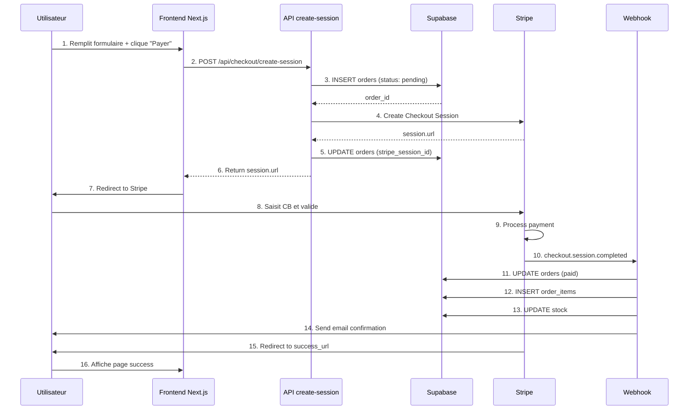

# 📘 Documentation complète : Implémentation Stripe Checkout avec Supabase

**Projet** : .blancherenaudin

**Stack** : Next.js 15 + Supabase + Stripe Checkout (redirection)

**Date** : 17 octobre 2025

---

## 📋 Table des matières

1. [Vue d&#39;ensemble du flux](#1-vue-densemble-du-flux)
2. [Architecture des composants](#2-architecture-des-composants)
3. [Structure de la base de données](#3-structure-de-la-base-de-donn%C3%A9es)
4. [Phase 1 : Préparation du checkout](#4-phase-1--pr%C3%A9paration-du-checkout)
5. [Phase 2 : Création de la session Stripe](#5-phase-2--cr%C3%A9ation-de-la-session-stripe)
6. [Phase 3 : Paiement chez Stripe](#6-phase-3--paiement-chez-stripe)
7. [Phase 4 : Webhooks et confirmation](#7-phase-4--webhooks-et-confirmation)
8. [Phase 5 : Retour utilisateur](#8-phase-5--retour-utilisateur)
9. [Gestion des erreurs](#9-gestion-des-erreurs)
10. [Configuration et déploiement](#10-configuration-et-d%C3%A9ploiement)
11. [Tests et validation](#11-tests-et-validation)

---

## 1. Vue d'ensemble du flux

### 🔄 Diagramme de séquence complet

mermaid



### ⏱️ Timeline

```
T+0s     │ Click "Payer"
T+0.5s   │ Création commande Supabase
T+1s     │ Création session Stripe
T+1.5s   │ Redirection vers Stripe
T+30s    │ Utilisateur remplit CB
T+31s    │ Stripe traite le paiement
T+32s    │ Webhook confirme le paiement
T+32.5s  │ Création order_items + stock
T+33s    │ Email envoyé
T+34s    │ Redirection vers /checkout/success
```

---

## 2. Architecture des composants

### 📁 Structure des fichiers

```
src/
├── app/
│   ├── checkout/
│   │   ├── page.tsx                    # ✅ Formulaire checkout
│   │   ├── success/
│   │   │   └── page.tsx                # ✅ Page confirmation
│   │   └── cancel/
│   │       └── page.tsx                # ⚠️ Page annulation
│   │
│   └── api/
│       ├── checkout/
│       │   └── create-session/
│       │       └── route.ts            # 🔑 Création session Stripe
│       │
│       └── webhooks/
│           └── stripe/
│               └── route.ts            # 🔑 Réception événements Stripe
│
├── lib/
│   ├── stripe.ts                       # ✅ Client Stripe
│   ├── supabase-admin.ts               # ✅ Client Supabase admin
│   ├── email/
│   │   ├── send.ts                     # 📧 Envoi emails
│   │   └── order-confirmation.tsx      # 📧 Template email
│   │
│   └── stock/
│       └── decrement-stock.ts          # 📦 Gestion stock
│
└── store/
    └── useCartStore.ts                 # 🛒 Zustand cart store
```

### 🎯 Rôle de chaque composant

<pre class="font-ui border-border-100/50 overflow-x-scroll w-full rounded border-[0.5px] shadow-[0_2px_12px_hsl(var(--always-black)/5%)]"><table class="bg-bg-100 min-w-full border-separate border-spacing-0 text-sm leading-[1.88888] whitespace-normal"><thead class="border-b-border-100/50 border-b-[0.5px] text-left"><tr class="[tbody>&]:odd:bg-bg-500/10"><th class="text-text-000 [&:not(:first-child)]:-x-[hsla(var(--border-100) / 0.5)] px-2 [&:not(:first-child)]:border-l-[0.5px]">Composant</th><th class="text-text-000 [&:not(:first-child)]:-x-[hsla(var(--border-100) / 0.5)] px-2 [&:not(:first-child)]:border-l-[0.5px]">Type</th><th class="text-text-000 [&:not(:first-child)]:-x-[hsla(var(--border-100) / 0.5)] px-2 [&:not(:first-child)]:border-l-[0.5px]">Rôle</th><th class="text-text-000 [&:not(:first-child)]:-x-[hsla(var(--border-100) / 0.5)] px-2 [&:not(:first-child)]:border-l-[0.5px]">Déclenché par</th></tr></thead><tbody><tr class="[tbody>&]:odd:bg-bg-500/10"><td class="border-t-border-100/50 [&:not(:first-child)]:-x-[hsla(var(--border-100) / 0.5)] border-t-[0.5px] px-2 [&:not(:first-child)]:border-l-[0.5px]"><code class="bg-text-200/5 border border-0.5 border-border-300 text-danger-000 whitespace-pre-wrap rounded-[0.4rem] px-1 py-px text-[0.9rem]">/checkout</code></td><td class="border-t-border-100/50 [&:not(:first-child)]:-x-[hsla(var(--border-100) / 0.5)] border-t-[0.5px] px-2 [&:not(:first-child)]:border-l-[0.5px]">Page</td><td class="border-t-border-100/50 [&:not(:first-child)]:-x-[hsla(var(--border-100) / 0.5)] border-t-[0.5px] px-2 [&:not(:first-child)]:border-l-[0.5px]">Afficher formulaire checkout</td><td class="border-t-border-100/50 [&:not(:first-child)]:-x-[hsla(var(--border-100) / 0.5)] border-t-[0.5px] px-2 [&:not(:first-child)]:border-l-[0.5px]">Navigation utilisateur</td></tr><tr class="[tbody>&]:odd:bg-bg-500/10"><td class="border-t-border-100/50 [&:not(:first-child)]:-x-[hsla(var(--border-100) / 0.5)] border-t-[0.5px] px-2 [&:not(:first-child)]:border-l-[0.5px]"><code class="bg-text-200/5 border border-0.5 border-border-300 text-danger-000 whitespace-pre-wrap rounded-[0.4rem] px-1 py-px text-[0.9rem]">/api/checkout/create-session</code></td><td class="border-t-border-100/50 [&:not(:first-child)]:-x-[hsla(var(--border-100) / 0.5)] border-t-[0.5px] px-2 [&:not(:first-child)]:border-l-[0.5px]">API Route</td><td class="border-t-border-100/50 [&:not(:first-child)]:-x-[hsla(var(--border-100) / 0.5)] border-t-[0.5px] px-2 [&:not(:first-child)]:border-l-[0.5px]">Créer commande + session Stripe</td><td class="border-t-border-100/50 [&:not(:first-child)]:-x-[hsla(var(--border-100) / 0.5)] border-t-[0.5px] px-2 [&:not(:first-child)]:border-l-[0.5px]">Submit formulaire</td></tr><tr class="[tbody>&]:odd:bg-bg-500/10"><td class="border-t-border-100/50 [&:not(:first-child)]:-x-[hsla(var(--border-100) / 0.5)] border-t-[0.5px] px-2 [&:not(:first-child)]:border-l-[0.5px]">Stripe Checkout</td><td class="border-t-border-100/50 [&:not(:first-child)]:-x-[hsla(var(--border-100) / 0.5)] border-t-[0.5px] px-2 [&:not(:first-child)]:border-l-[0.5px]">Externe</td><td class="border-t-border-100/50 [&:not(:first-child)]:-x-[hsla(var(--border-100) / 0.5)] border-t-[0.5px] px-2 [&:not(:first-child)]:border-l-[0.5px]">Page de paiement hébergée</td><td class="border-t-border-100/50 [&:not(:first-child)]:-x-[hsla(var(--border-100) / 0.5)] border-t-[0.5px] px-2 [&:not(:first-child)]:border-l-[0.5px]">Redirection depuis API</td></tr><tr class="[tbody>&]:odd:bg-bg-500/10"><td class="border-t-border-100/50 [&:not(:first-child)]:-x-[hsla(var(--border-100) / 0.5)] border-t-[0.5px] px-2 [&:not(:first-child)]:border-l-[0.5px]"><code class="bg-text-200/5 border border-0.5 border-border-300 text-danger-000 whitespace-pre-wrap rounded-[0.4rem] px-1 py-px text-[0.9rem]">/api/webhooks/stripe</code></td><td class="border-t-border-100/50 [&:not(:first-child)]:-x-[hsla(var(--border-100) / 0.5)] border-t-[0.5px] px-2 [&:not(:first-child)]:border-l-[0.5px]">API Route</td><td class="border-t-border-100/50 [&:not(:first-child)]:-x-[hsla(var(--border-100) / 0.5)] border-t-[0.5px] px-2 [&:not(:first-child)]:border-l-[0.5px]">Confirmer paiement</td><td class="border-t-border-100/50 [&:not(:first-child)]:-x-[hsla(var(--border-100) / 0.5)] border-t-[0.5px] px-2 [&:not(:first-child)]:border-l-[0.5px]">Événement Stripe</td></tr><tr class="[tbody>&]:odd:bg-bg-500/10"><td class="border-t-border-100/50 [&:not(:first-child)]:-x-[hsla(var(--border-100) / 0.5)] border-t-[0.5px] px-2 [&:not(:first-child)]:border-l-[0.5px]"><code class="bg-text-200/5 border border-0.5 border-border-300 text-danger-000 whitespace-pre-wrap rounded-[0.4rem] px-1 py-px text-[0.9rem]">/checkout/success</code></td><td class="border-t-border-100/50 [&:not(:first-child)]:-x-[hsla(var(--border-100) / 0.5)] border-t-[0.5px] px-2 [&:not(:first-child)]:border-l-[0.5px]">Page</td><td class="border-t-border-100/50 [&:not(:first-child)]:-x-[hsla(var(--border-100) / 0.5)] border-t-[0.5px] px-2 [&:not(:first-child)]:border-l-[0.5px]">Confirmation visuelle</td><td class="border-t-border-100/50 [&:not(:first-child)]:-x-[hsla(var(--border-100) / 0.5)] border-t-[0.5px] px-2 [&:not(:first-child)]:border-l-[0.5px]">Redirection Stripe</td></tr><tr class="[tbody>&]:odd:bg-bg-500/10"><td class="border-t-border-100/50 [&:not(:first-child)]:-x-[hsla(var(--border-100) / 0.5)] border-t-[0.5px] px-2 [&:not(:first-child)]:border-l-[0.5px]"><code class="bg-text-200/5 border border-0.5 border-border-300 text-danger-000 whitespace-pre-wrap rounded-[0.4rem] px-1 py-px text-[0.9rem]">sendOrderConfirmation</code></td><td class="border-t-border-100/50 [&:not(:first-child)]:-x-[hsla(var(--border-100) / 0.5)] border-t-[0.5px] px-2 [&:not(:first-child)]:border-l-[0.5px]">Service</td><td class="border-t-border-100/50 [&:not(:first-child)]:-x-[hsla(var(--border-100) / 0.5)] border-t-[0.5px] px-2 [&:not(:first-child)]:border-l-[0.5px]">Envoyer email</td><td class="border-t-border-100/50 [&:not(:first-child)]:-x-[hsla(var(--border-100) / 0.5)] border-t-[0.5px] px-2 [&:not(:first-child)]:border-l-[0.5px]">Webhook</td></tr><tr class="[tbody>&]:odd:bg-bg-500/10"><td class="border-t-border-100/50 [&:not(:first-child)]:-x-[hsla(var(--border-100) / 0.5)] border-t-[0.5px] px-2 [&:not(:first-child)]:border-l-[0.5px]"><code class="bg-text-200/5 border border-0.5 border-border-300 text-danger-000 whitespace-pre-wrap rounded-[0.4rem] px-1 py-px text-[0.9rem]">decrementStock</code></td><td class="border-t-border-100/50 [&:not(:first-child)]:-x-[hsla(var(--border-100) / 0.5)] border-t-[0.5px] px-2 [&:not(:first-child)]:border-l-[0.5px]">Service</td><td class="border-t-border-100/50 [&:not(:first-child)]:-x-[hsla(var(--border-100) / 0.5)] border-t-[0.5px] px-2 [&:not(:first-child)]:border-l-[0.5px]">Mettre à jour stock</td><td class="border-t-border-100/50 [&:not(:first-child)]:-x-[hsla(var(--border-100) / 0.5)] border-t-[0.5px] px-2 [&:not(:first-child)]:border-l-[0.5px]">Webhook</td></tr></tbody></table></pre>

---

## 3. Structure de la base de données

### 📊 Tables Supabase

#### Table `orders`

sql

```sql
CREATETABLE orders (
-- Identifiants
    id UUID PRIMARYKEYDEFAULT gen_random_uuid(),
    user_id UUID REFERENCES auth.users(id)ONDELETESETNULL,
    order_number VARCHARNOTNULLUNIQUE,

-- Client
    customer_email VARCHAR,
    customer_name VARCHAR,
    customer_phone VARCHAR,

-- Adresses (JSONB)
    shipping_address JSONB,
    billing_address JSONB,

-- Montants
    total_amount NUMERICNOTNULL,
    shipping_amount NUMERICDEFAULT0,
    tax_amount NUMERICDEFAULT0,
    discount_amount NUMERICDEFAULT0,

-- Livraison
    shipping_method VARCHAR,
    tracking_number VARCHAR,
    tracking_url VARCHAR,

-- Promotion
    promo_code VARCHAR,

-- Statuts
statusVARCHARDEFAULT'pending',
    payment_status VARCHARDEFAULT'pending',
    fulfillment_status VARCHARDEFAULT'unfulfilled',

-- Stripe
    stripe_session_id TEXT,
    payment_intent_id VARCHAR,

-- Notes
    notes TEXT,
    admin_notes TEXT,

-- Timestamps
    created_at TIMESTAMPTZ NOTNULLDEFAULTNOW(),
    updated_at TIMESTAMPTZ NOTNULLDEFAULTNOW(),
    paid_at TIMESTAMPTZ,
    shipped_at TIMESTAMPTZ,
    delivered_at TIMESTAMPTZ,
    cancelled_at TIMESTAMPTZ,

-- Contraintes
CONSTRAINT orders_status_check CHECK(
statusIN('pending','paid','processing','shipped','delivered','cancelled','refunded')
),
CONSTRAINT orders_fulfillment_status_check CHECK(
        fulfillment_status IN('unfulfilled','partial','fulfilled')
)
);
```

#### Table `order_items`

sql

```sql
CREATETABLE order_items (
    id UUID PRIMARYKEYDEFAULT gen_random_uuid(),
    order_id UUID REFERENCES orders(id)ONDELETECASCADE,

-- Références produit
    product_id UUID REFERENCES products(id),
    variant_id UUID REFERENCES product_variants(id),

-- Données figées (snapshot)
    product_name VARCHAR,
    product_sku VARCHAR,
    variant_name VARCHAR,
    variant_value VARCHAR,
    image_url VARCHAR,
    product_snapshot JSONB,

-- Quantités et prix
    quantity INTEGERNOTNULL,
    unit_price NUMERICNOTNULL,
    total_price NUMERICNOTNULL,

-- Timestamp
    created_at TIMESTAMPTZ NOTNULLDEFAULTNOW()
);
```

#### Table `order_status_history`

sql

```sql
CREATETABLE order_status_history (
    id UUID PRIMARYKEYDEFAULT gen_random_uuid(),
    order_id UUID NOTNULLREFERENCES orders(id)ONDELETECASCADE,
    from_status VARCHAR,
    to_status VARCHARNOTNULL,
commentTEXT,
    changed_by UUID REFERENCES auth.users(id),
    created_at TIMESTAMPTZ DEFAULTNOW()
);
```

### 📐 Vues

#### Vue `order_details`

sql

```sql
CREATEORREPLACEVIEW order_details AS
SELECT
    o.*,
COUNT(oi.id)AS items_count,
    u.email AS user_email,
    p.first_name ||' '|| p.last_name AS user_full_name
FROM orders o
LEFTJOIN order_items oi ON oi.order_id = o.id
LEFTJOIN auth.users u ON u.id = o.user_id
LEFTJOIN profiles p ON p.id = o.user_id
GROUPBY o.id, u.email, p.first_name, p.last_name;
```

#### Vue `monthly_order_stats`

sql

```sql
CREATEORREPLACEVIEW monthly_order_stats AS
SELECT
    DATE_TRUNC('month', created_at)ASmonth,
COUNT(*)AS order_count,
SUM(total_amount)AS total_revenue,
AVG(total_amount)AS avg_order_value
FROM orders
WHEREstatusNOTIN('cancelled','refunded')
GROUPBY DATE_TRUNC('month', created_at)
ORDERBYmonthDESC;
```

### 🔧 Triggers

sql

```sql
-- 1. Génération automatique du order_number
CREATEORREPLACEFUNCTION set_order_number()
RETURNSTRIGGERAS $$
BEGIN
    NEW.order_number :='ORD-'|| TO_CHAR(NOW(),'YYYYMMDD')||'-'|| LPAD(NEXTVAL('order_number_seq')::TEXT,3,'0');
RETURN NEW;
END;
$$ LANGUAGE plpgsql;

CREATETRIGGER trigger_set_order_number
    BEFORE INSERTON orders
FOR EACH ROW
EXECUTEFUNCTION set_order_number();

-- 2. Mise à jour automatique de updated_at
CREATEORREPLACEFUNCTION update_updated_at_column()
RETURNSTRIGGERAS $$
BEGIN
    NEW.updated_at =NOW();
RETURN NEW;
END;
$$ LANGUAGE plpgsql;

CREATETRIGGER trigger_orders_updated_at
    BEFORE UPDATEON orders
FOR EACH ROW
EXECUTEFUNCTION update_updated_at_column();

-- 3. Historique automatique des changements de statut
CREATEORREPLACEFUNCTION track_order_status_change()
RETURNSTRIGGERAS $$
BEGIN
IF OLD.statusISDISTINCTFROM NEW.statusTHEN
INSERTINTO order_status_history (order_id, from_status, to_status)
VALUES(NEW.id, OLD.status, NEW.status);
ENDIF;
RETURN NEW;
END;
$$ LANGUAGE plpgsql;

CREATETRIGGER trigger_track_status_change
AFTERUPDATEON orders
FOR EACH ROW
EXECUTEFUNCTION track_order_status_change();
```

---

## 4. Phase 1 : Préparation du checkout

### 🎨 Frontend : `/checkout/page.tsx`

typescript

```typescript
'use client'

import{ useState }from'react'
import{ useRouter }from'next/navigation'
import{ useCartStore }from'@/store/useCartStore'
import{Button}from'@/components/ui/button'
import{Input}from'@/components/ui/input'
import{Label}from'@/components/ui/label'
import{ toast }from'sonner'

interfaceShippingAddress{
  first_name:string
  last_name:string
  email:string
  phone:string
  address_line1:string
  address_line2?:string
  city:string
  postal_code:string
  country:string
}

exportdefaultfunctionCheckoutPage(){
const router =useRouter()
const{ items, getTotalPrice, clearCart }=useCartStore()
const[isLoading, setIsLoading]=useState(false)

const[shippingAddress, setShippingAddress]=useState<ShippingAddress>({
    first_name:'',
    last_name:'',
    email:'',
    phone:'',
    address_line1:'',
    address_line2:'',
    city:'',
    postal_code:'',
    country:'FR',
})

consthandleSubmit=async(e:React.FormEvent)=>{
    e.preventDefault()

// Validation
if(!shippingAddress.first_name||!shippingAddress.email||!shippingAddress.address_line1){
      toast.error('Veuillez remplir tous les champs obligatoires')
return
}

if(items.length===0){
      toast.error('Votre panier est vide')
      router.push('/cart')
return
}

setIsLoading(true)

try{
// Appel API pour créer la session Stripe
const response =awaitfetch('/api/checkout/create-session',{
        method:'POST',
        headers:{'Content-Type':'application/json'},
        body:JSON.stringify({
          items: items.map(item =>({
            productId: item.productId,
            variantId: item.variantId,
            name: item.name,
            price: item.price,
            quantity: item.quantity,
            size: item.size,
            color: item.color,
            image: item.image,
})),
          shippingAddress,
}),
})

if(!response.ok){
thrownewError('Erreur lors de la création de la session')
}

const{ url, error }=await response.json()

if(error){
        toast.error(error)
return
}

// ✅ Redirection vers Stripe Checkout
window.location.href= url
}catch(error){
console.error('Checkout error:', error)
      toast.error('Erreur lors du paiement. Veuillez réessayer.')
}finally{
setIsLoading(false)
}
}

return(
<div className="max-w-4xl mx-auto px-4 py-16">
<h1 className="text-3xl font-bold mb-8">Checkout</h1>

<form onSubmit={handleSubmit}>
{/* Formulaire d'adresse */}
<div className="space-y-4 mb-8">
<h2 className="text-xl font-semibold mb-4">Informations de livraison</h2>

<div className="grid grid-cols-1 md:grid-cols-2 gap-4">
<div>
<Label htmlFor="first_name">Prénom*</Label>
<Input
                id="first_name"
                value={shippingAddress.first_name}
                onChange={(e)=>setShippingAddress({...shippingAddress, first_name: e.target.value})}
                required
/>
</div>

<div>
<Label htmlFor="last_name">Nom*</Label>
<Input
                id="last_name"
                value={shippingAddress.last_name}
                onChange={(e)=>setShippingAddress({...shippingAddress, last_name: e.target.value})}
                required
/>
</div>
</div>

<div>
<Label htmlFor="email">Email*</Label>
<Input
              id="email"
              type="email"
              value={shippingAddress.email}
              onChange={(e)=>setShippingAddress({...shippingAddress, email: e.target.value})}
              required
/>
</div>

<div>
<Label htmlFor="phone">Téléphone</Label>
<Input
              id="phone"
              type="tel"
              value={shippingAddress.phone}
              onChange={(e)=>setShippingAddress({...shippingAddress, phone: e.target.value})}
/>
</div>

<div>
<Label htmlFor="address_line1">Adresse*</Label>
<Input
              id="address_line1"
              value={shippingAddress.address_line1}
              onChange={(e)=>setShippingAddress({...shippingAddress, address_line1: e.target.value})}
              required
/>
</div>

<div>
<Label htmlFor="address_line2">Complément d'adresse</Label>
<Input
              id="address_line2"
              value={shippingAddress.address_line2}
              onChange={(e)=>setShippingAddress({...shippingAddress, address_line2: e.target.value})}
/>
</div>

<div className="grid grid-cols-1 md:grid-cols-2 gap-4">
<div>
<Label htmlFor="postal_code">Code postal *</Label>
<Input
                id="postal_code"
                value={shippingAddress.postal_code}
                onChange={(e)=>setShippingAddress({...shippingAddress, postal_code: e.target.value})}
                required
/>
</div>

<div>
<Label htmlFor="city">Ville*</Label>
<Input
                id="city"
                value={shippingAddress.city}
                onChange={(e)=>setShippingAddress({...shippingAddress, city: e.target.value})}
                required
/>
</div>
</div>
</div>

{/* Résumé panier */}
<div className="bg-gray-50 p-6 rounded-lg mb-8">
<h2 className="text-xl font-semibold mb-4">Résumé de la commande</h2>

<div className="space-y-2 mb-4">
{items.map((item)=>(
<div key={`${item.productId}-${item.variantId}`} className="flex justify-between text-sm">
<span>
{item.name}{item.size&&`- ${item.size}`}{item.color&&`- ${item.color}`} × {item.quantity}
</span>
<span>{(item.price* item.quantity).toFixed(2)}€</span>
</div>
))}
</div>

<div className="border-t pt-4 space-y-2">
<div className="flex justify-between">
<span>Sous-total</span>
<span>{getTotalPrice().toFixed(2)}€</span>
</div>
<div className="flex justify-between">
<span>Livraison</span>
<span>Gratuite</span>
</div>
<div className="flex justify-between font-bold text-lg">
<span>Total</span>
<span>{getTotalPrice().toFixed(2)}€</span>
</div>
</div>
</div>

{/* Bouton paiement */}
<Button
          type="submit"
          disabled={isLoading}
          className="w-full"
          size="lg"
>
{isLoading ?'Redirection vers Stripe...':'Procéder au paiement'}
</Button>

<p className="text-xs text-gray-500 text-center mt-4">
Paiement sécurisé par Stripe.Vos informations bancaires ne sont jamais stockées sur nos serveurs.
</p>
</form>
</div>
)
}
```

### 📊 État des données - Phase 1

<pre class="font-ui border-border-100/50 overflow-x-scroll w-full rounded border-[0.5px] shadow-[0_2px_12px_hsl(var(--always-black)/5%)]"><table class="bg-bg-100 min-w-full border-separate border-spacing-0 text-sm leading-[1.88888] whitespace-normal"><thead class="border-b-border-100/50 border-b-[0.5px] text-left"><tr class="[tbody>&]:odd:bg-bg-500/10"><th class="text-text-000 [&:not(:first-child)]:-x-[hsla(var(--border-100) / 0.5)] px-2 [&:not(:first-child)]:border-l-[0.5px]">Table</th><th class="text-text-000 [&:not(:first-child)]:-x-[hsla(var(--border-100) / 0.5)] px-2 [&:not(:first-child)]:border-l-[0.5px]">État</th><th class="text-text-000 [&:not(:first-child)]:-x-[hsla(var(--border-100) / 0.5)] px-2 [&:not(:first-child)]:border-l-[0.5px]">Contenu</th></tr></thead><tbody><tr class="[tbody>&]:odd:bg-bg-500/10"><td class="border-t-border-100/50 [&:not(:first-child)]:-x-[hsla(var(--border-100) / 0.5)] border-t-[0.5px] px-2 [&:not(:first-child)]:border-l-[0.5px]"><code class="bg-text-200/5 border border-0.5 border-border-300 text-danger-000 whitespace-pre-wrap rounded-[0.4rem] px-1 py-px text-[0.9rem]">orders</code></td><td class="border-t-border-100/50 [&:not(:first-child)]:-x-[hsla(var(--border-100) / 0.5)] border-t-[0.5px] px-2 [&:not(:first-child)]:border-l-[0.5px]">❌ Vide</td><td class="border-t-border-100/50 [&:not(:first-child)]:-x-[hsla(var(--border-100) / 0.5)] border-t-[0.5px] px-2 [&:not(:first-child)]:border-l-[0.5px]">Aucune donnée</td></tr><tr class="[tbody>&]:odd:bg-bg-500/10"><td class="border-t-border-100/50 [&:not(:first-child)]:-x-[hsla(var(--border-100) / 0.5)] border-t-[0.5px] px-2 [&:not(:first-child)]:border-l-[0.5px]"><code class="bg-text-200/5 border border-0.5 border-border-300 text-danger-000 whitespace-pre-wrap rounded-[0.4rem] px-1 py-px text-[0.9rem]">order_items</code></td><td class="border-t-border-100/50 [&:not(:first-child)]:-x-[hsla(var(--border-100) / 0.5)] border-t-[0.5px] px-2 [&:not(:first-child)]:border-l-[0.5px]">❌ Vide</td><td class="border-t-border-100/50 [&:not(:first-child)]:-x-[hsla(var(--border-100) / 0.5)] border-t-[0.5px] px-2 [&:not(:first-child)]:border-l-[0.5px]">Aucune donnée</td></tr><tr class="[tbody>&]:odd:bg-bg-500/10"><td class="border-t-border-100/50 [&:not(:first-child)]:-x-[hsla(var(--border-100) / 0.5)] border-t-[0.5px] px-2 [&:not(:first-child)]:border-l-[0.5px]"><code class="bg-text-200/5 border border-0.5 border-border-300 text-danger-000 whitespace-pre-wrap rounded-[0.4rem] px-1 py-px text-[0.9rem]">order_status_history</code></td><td class="border-t-border-100/50 [&:not(:first-child)]:-x-[hsla(var(--border-100) / 0.5)] border-t-[0.5px] px-2 [&:not(:first-child)]:border-l-[0.5px]">❌ Vide</td><td class="border-t-border-100/50 [&:not(:first-child)]:-x-[hsla(var(--border-100) / 0.5)] border-t-[0.5px] px-2 [&:not(:first-child)]:border-l-[0.5px]">Aucune donnée</td></tr><tr class="[tbody>&]:odd:bg-bg-500/10"><td class="border-t-border-100/50 [&:not(:first-child)]:-x-[hsla(var(--border-100) / 0.5)] border-t-[0.5px] px-2 [&:not(:first-child)]:border-l-[0.5px]">Stripe</td><td class="border-t-border-100/50 [&:not(:first-child)]:-x-[hsla(var(--border-100) / 0.5)] border-t-[0.5px] px-2 [&:not(:first-child)]:border-l-[0.5px]">❌ Aucune session</td><td class="border-t-border-100/50 [&:not(:first-child)]:-x-[hsla(var(--border-100) / 0.5)] border-t-[0.5px] px-2 [&:not(:first-child)]:border-l-[0.5px]">Pas encore créé</td></tr></tbody></table></pre>

---

## 5. Phase 2 : Création de la session Stripe

### 🔧 Backend : `/api/checkout/create-session/route.ts`

typescript

```typescript
import{NextRequest,NextResponse}from'next/server'
import{ stripe }from'@/lib/stripe'
import{ supabaseAdmin }from'@/lib/supabase-admin'

interfaceCartItem{
  productId:string
  variantId:string|null
  name:string
  price:number
  quantity:number
  size?:string
  color?:string
  image?:string
}

interfaceShippingAddress{
  first_name:string
  last_name:string
  email:string
  phone?:string
  address_line1:string
  address_line2?:string
  city:string
  postal_code:string
  country:string
}

exportasyncfunctionPOST(req:NextRequest){
try{
const{ items, shippingAddress }=await req.json()as{
      items:CartItem[]
      shippingAddress:ShippingAddress
}

// ━━━━━━━━━━━━━━━━━━━━━━━━━━━━━━━━━━━━━━━━━━
// VALIDATION
// ━━━━━━━━━━━━━━━━━━━━━━━━━━━━━━━━━━━━━━━━━━
if(!items || items.length===0){
returnNextResponse.json(
{ error:'Le panier est vide'},
{ status:400}
)
}

if(!shippingAddress ||!shippingAddress.email||!shippingAddress.address_line1){
returnNextResponse.json(
{ error:'Adresse de livraison incomplète'},
{ status:400}
)
}

// ━━━━━━━━━━━━━━━━━━━━━━━━━━━━━━━━━━━━━━━━━━
// CALCUL DES MONTANTS
// ━━━━━━━━━━━━━━━━━━━━━━━━━━━━━━━━━━━━━━━━━━
const subtotal = items.reduce((sum, item)=> sum + item.price* item.quantity,0)
const shippingCost =0// Gratuit pour l'instant
const taxAmount =0// À implémenter si nécessaire
const discountAmount =0// À implémenter avec promo_code
const totalAmount = subtotal + shippingCost - discountAmount

console.log('💰 Order calculation:',{
      subtotal,
      shippingCost,
      taxAmount,
      discountAmount,
      totalAmount,
})

// ━━━━━━━━━━━━━━━━━━━━━━━━━━━━━━━━━━━━━━━━━━
// ÉTAPE 1 : CRÉER LA COMMANDE DANS SUPABASE
// ━━━━━━━━━━━━━━━━━━━━━━━━━━━━━━━━━━━━━━━━━━
console.log('📝 Creating order in Supabase...')

const{ data: order, error: orderError }=await supabaseAdmin
.from('orders')
.insert({
// ⚠️ NE PAS mettre order_number → généré par trigger

// Client
        customer_email: shippingAddress.email,
        customer_name:`${shippingAddress.first_name}${shippingAddress.last_name}`,
        customer_phone: shippingAddress.phone||null,

// Adresses (JSONB)
        shipping_address: shippingAddress,
        billing_address: shippingAddress,// Même adresse par défaut

// Montants
        total_amount: totalAmount,
        shipping_amount: shippingCost,
        tax_amount: taxAmount,
        discount_amount: discountAmount,

// Livraison
        shipping_method:'standard',

// Statuts (defaults via DB)
// status: 'pending'
// payment_status: 'pending'
// fulfillment_status: 'unfulfilled'

// Notes
        notes:null,
        admin_notes:null,

// Stripe (vides pour l'instant)
        stripe_session_id:null,
        payment_intent_id:null,
})
.select()
.single()

if(orderError ||!order){
console.error('❌ Error creating order:', orderError)
returnNextResponse.json(
{ error:'Erreur lors de la création de la commande'},
{ status:500}
)
}

console.log(`✅ Order created: ${order.order_number} (${order.id})`)

// ━━━━━━━━━━━━━━━━━━━━━━━━━━━━━━━━━━━━━━━━━━
// ÉTAPE 2 : CRÉER LA SESSION STRIPE
// ━━━━━━━━━━━━━━━━━━━━━━━━━━━━━━━━━━━━━━━━━━
console.log('💳 Creating Stripe Checkout session...')

const lineItems = items.map((item)=>({
      price_data:{
        currency:'eur',
        product_data:{
          name: item.name,
          description:[item.size, item.color].filter(Boolean).join(' - ')||undefined,
          images: item.image?[item.image]:[],
},
        unit_amount:Math.round(item.price*100),// Convertir en centimes
},
      quantity: item.quantity,
}))

const session =await stripe.checkout.sessions.create({
      payment_method_types:['card'],
      line_items: lineItems,
      mode:'payment',

// URLs de redirection
      success_url:`${process.env.NEXT_PUBLIC_BASE_URL}/checkout/success?session_id={CHECKOUT_SESSION_ID}`,
      cancel_url:`${process.env.NEXT_PUBLIC_BASE_URL}/checkout/cancel`,

// Email client
      customer_email: shippingAddress.email,

// Locale
      locale:'fr',

// ⭐ MÉTADONNÉES CRITIQUES pour le webhook
      metadata:{
        order_id: order.id,
        order_number: order.order_number,
// Sérialiser les items pour le webhook
        items:JSON.stringify(
          items.map((item)=>({
            product_id: item.productId,
            variant_id: item.variantId,
            name: item.name,
            size: item.size,
            color: item.color,
            quantity: item.quantity,
            price: item.price,
            image: item.image,
}))
),
},
})

console.log(`✅ Stripe session created: ${session.id}`)

// ━━━━━━━━━━━━━━━━━━━━━━━━━━━━━━━━━━━━━━━━━━
// ÉTAPE 3 : LIER LA SESSION À LA COMMANDE
// ━━━━━━━━━━━━━━━━━━━━━━━━━━━━━━━━━━━━━━━━━━
const{ error: updateError }=await supabaseAdmin
.from('orders')
.update({ stripe_session_id: session.id})
.eq('id', order.id)

if(updateError){
console.error('⚠️ Error linking session to order:', updateError)
// Non bloquant, le webhook pourra retrouver la commande via metadata
}

console.log(`✅ Session linked to order ${order.order_number}`)

// ━━━━━━━━━━━━━━━━━━━━━━━━━━━━━━━━━━━━━━━━━━
// RETOURNER L'URL STRIPE AU CLIENT
// ━━━━━━━━━━━━━━━━━━━━━━━━━━━━━━━━━━━━━━━━━━
returnNextResponse.json({
      url: session.url,
      sessionId: session.id,
})
}catch(error){
console.error('❌ Checkout session creation error:', error)
returnNextResponse.json(
{ error:'Erreur serveur lors de la création de la session'},
{ status:500}
)
}
}
```

### 📊 État des données - Phase 2

#### Table `orders`

typescript

```typescript
{
  id:'uuid-abc-123',
  order_number:'ORD-20251017-001',// ✅ Généré par trigger
  user_id:null,

  customer_email:'marie@example.com',
  customer_name:'Marie Dupont',
  customer_phone:'+33612345678',

  shipping_address:{
    first_name:'Marie',
    last_name:'Dupont',
    email:'marie@example.com',
    phone:'+33612345678',
    address_line1:'12 rue de Rivoli',
    address_line2:'Apt 4',
    city:'Paris',
    postal_code:'75001',
    country:'FR'
},
  billing_address:{/* identique */},

  total_amount:159.00,
  shipping_amount:0.00,
  tax_amount:0.00,
  discount_amount:0.00,

  shipping_method:'standard',
  tracking_number:null,
  tracking_url:null,

  promo_code:null,

  status:'pending',// ✅ DEFAULT
  payment_status:'pending',// ✅ DEFAULT
  fulfillment_status:'unfulfilled',// ✅ DEFAULT

  stripe_session_id:'cs_test_a1b2c3...',// ✅ Lié après création
  payment_intent_id:null,// ⏳ Rempli par webhook

  notes:null,
  admin_notes:null,

  created_at:'2025-10-17T10:30:00Z',// ✅ AUTO
  updated_at:'2025-10-17T10:30:15Z',// ✅ AUTO (trigger)
  paid_at:null,// ⏳ Rempli par webhook
  shipped_at:null,
  delivered_at:null,
  cancelled_at:null,
}
```

#### Table `order_status_history`

typescript

```typescript
;[
  {
    id: 'uuid-history-1',
    order_id: 'uuid-abc-123',
    from_status: null, // ✅ Première entrée
    to_status: 'pending',
    comment: null,
    changed_by: null,
    created_at: '2025-10-17T10:30:00Z',
  },
]
```

#### Table `order_items`

```
⚠️ VIDE-Sera remplie par le webhook
```

#### Stripe Session

typescript

```typescript
{
  id:'cs_test_a1b2c3...',
  object:'checkout.session',
  amount_total:15900,// En centimes
  currency:'eur',
  customer_email:'marie@example.com',
  locale:'fr',
  mode:'payment',
  payment_status:'unpaid',
  status:'open',
  url:'https://checkout.stripe.com/c/pay/cs_test_...',

  metadata:{
    order_id:'uuid-abc-123',
    order_number:'ORD-20251017-001',
    items:'[{"product_id":"...","variant_id":"...","name":"Robe noire",...}]'
},

  success_url:'https://blancherenaudin.com/checkout/success?session_id={CHECKOUT_SESSION_ID}',
  cancel_url:'https://blancherenaudin.com/checkout/cancel',
}
```

---

## 6. Phase 3 : Paiement chez Stripe

### 🎨 Interface Stripe Checkout

L'utilisateur est redirigé vers une page hébergée par Stripe :

```
https://checkout.stripe.com/c/pay/cs_test_a1b2c3...
```

#### Personnalisation possible (Dashboard Stripe)

1. **Logo** : Settings > Branding > Icon
2. **Couleur principale** : Settings > Branding > Brand color
3. **Nom de l'entreprise** : Settings > Account details > Public details

#### Moyens de paiement disponibles

- ✅ Carte bancaire (Visa, Mastercard, Amex)
- ✅ Apple Pay (si device compatible)
- ✅ Google Pay (si device compatible)
- 🔧 PayPal (à activer manuellement)
- 🔧 Bancontact, iDEAL, etc. (selon pays)

### ⏱️ Actions utilisateur

1. **Saisir numéro de carte** : 16 chiffres
2. **Date d'expiration** : MM/AA
3. **CVC** : 3 chiffres au dos
4. **Nom sur la carte** : Optionnel
5. **Click "Payer"**

### 🔒 Sécurité Stripe

- ✅ Certification PCI DSS Level 1
- ✅ 3D Secure automatique (Strong Customer Authentication)
- ✅ Détection de fraude en temps réel
- ✅ Aucune donnée bancaire ne transite par votre serveur

### 📊 État des données - Phase 3

Pendant que l'utilisateur est sur la page Stripe, **aucune modification** n'est apportée à Supabase.

<pre class="font-ui border-border-100/50 overflow-x-scroll w-full rounded border-[0.5px] shadow-[0_2px_12px_hsl(var(--always-black)/5%)]"><table class="bg-bg-100 min-w-full border-separate border-spacing-0 text-sm leading-[1.88888] whitespace-normal"><thead class="border-b-border-100/50 border-b-[0.5px] text-left"><tr class="[tbody>&]:odd:bg-bg-500/10"><th class="text-text-000 [&:not(:first-child)]:-x-[hsla(var(--border-100) / 0.5)] px-2 [&:not(:first-child)]:border-l-[0.5px]">Table</th><th class="text-text-000 [&:not(:first-child)]:-x-[hsla(var(--border-100) / 0.5)] px-2 [&:not(:first-child)]:border-l-[0.5px]">État</th><th class="text-text-000 [&:not(:first-child)]:-x-[hsla(var(--border-100) / 0.5)] px-2 [&:not(:first-child)]:border-l-[0.5px]">Changement</th></tr></thead><tbody><tr class="[tbody>&]:odd:bg-bg-500/10"><td class="border-t-border-100/50 [&:not(:first-child)]:-x-[hsla(var(--border-100) / 0.5)] border-t-[0.5px] px-2 [&:not(:first-child)]:border-l-[0.5px]"><code class="bg-text-200/5 border border-0.5 border-border-300 text-danger-000 whitespace-pre-wrap rounded-[0.4rem] px-1 py-px text-[0.9rem]">orders</code></td><td class="border-t-border-100/50 [&:not(:first-child)]:-x-[hsla(var(--border-100) / 0.5)] border-t-[0.5px] px-2 [&:not(:first-child)]:border-l-[0.5px]">✅ Existe</td><td class="border-t-border-100/50 [&:not(:first-child)]:-x-[hsla(var(--border-100) / 0.5)] border-t-[0.5px] px-2 [&:not(:first-child)]:border-l-[0.5px]">Aucun changement</td></tr><tr class="[tbody>&]:odd:bg-bg-500/10"><td class="border-t-border-100/50 [&:not(:first-child)]:-x-[hsla(var(--border-100) / 0.5)] border-t-[0.5px] px-2 [&:not(:first-child)]:border-l-[0.5px]"><code class="bg-text-200/5 border border-0.5 border-border-300 text-danger-000 whitespace-pre-wrap rounded-[0.4rem] px-1 py-px text-[0.9rem]">order_items</code></td><td class="border-t-border-100/50 [&:not(:first-child)]:-x-[hsla(var(--border-100) / 0.5)] border-t-[0.5px] px-2 [&:not(:first-child)]:border-l-[0.5px]">❌ Vide</td><td class="border-t-border-100/50 [&:not(:first-child)]:-x-[hsla(var(--border-100) / 0.5)] border-t-[0.5px] px-2 [&:not(:first-child)]:border-l-[0.5px]">Aucun changement</td></tr><tr class="[tbody>&]:odd:bg-bg-500/10"><td class="border-t-border-100/50 [&:not(:first-child)]:-x-[hsla(var(--border-100) / 0.5)] border-t-[0.5px] px-2 [&:not(:first-child)]:border-l-[0.5px]">Stripe Session</td><td class="border-t-border-100/50 [&:not(:first-child)]:-x-[hsla(var(--border-100) / 0.5)] border-t-[0.5px] px-2 [&:not(:first-child)]:border-l-[0.5px]"><code class="bg-text-200/5 border border-0.5 border-border-300 text-danger-000 whitespace-pre-wrap rounded-[0.4rem] px-1 py-px text-[0.9rem]">status: 'open'</code></td><td class="border-t-border-100/50 [&:not(:first-child)]:-x-[hsla(var(--border-100) / 0.5)] border-t-[0.5px] px-2 [&:not(:first-child)]:border-l-[0.5px]">→ Devient <code class="bg-text-200/5 border border-0.5 border-border-300 text-danger-000 whitespace-pre-wrap rounded-[0.4rem] px-1 py-px text-[0.9rem]">'complete'</code> après paiement</td></tr></tbody></table></pre>

---

## 7. Phase 4 : Webhooks et confirmation

### 🔧 Backend : `/api/webhooks/stripe/route.ts`

typescript

```typescript
import{NextRequest,NextResponse}from'next/server'
import{ stripe }from'@/lib/stripe'
import{ supabaseAdmin }from'@/lib/supabase-admin'
import{ sendOrderConfirmationHook }from'@/lib/email/send-order-confirmation-hook'
import{ decrementStockForOrder }from'@/lib/stock/decrement-stock'

// ✅ HELPER : Parser les adresses JSONB
functionparseAddress(address:any):any{
if(!address)returnnull
if(typeof address ==='string'){
try{
returnJSON.parse(address)
}catch{
console.error('⚠️ Failed to parse address:', address)
returnnull
}
}
return address
}

// ✅ HELPER : Envoyer l'email sans faire échouer le webhook
asyncfunctionsendConfirmationEmailSafe(orderId:string){
try{
console.log('📧 Attempting to send confirmation email...')
const result =awaitsendOrderConfirmationHook(orderId)

if(result.success){
console.log('✅ Confirmation email sent successfully')
}else{
console.error('⚠️ Email sending failed (non-critical):', result.error)
}
}catch(error){
console.error('⚠️ Email sending error (non-critical):', error)
}
}

// ━━━━━━━━━━━━━━━━━━━━━━━━━━━━━━━━━━━━━━━━━━
// ROUTE PRINCIPALE
// ━━━━━━━━━━━━━━━━━━━━━━━━━━━━━━━━━━━━━━━━━━
exportconst runtime ='nodejs'

exportasyncfunctionPOST(req:NextRequest){
const body =await req.text()
const signature = req.headers.get('stripe-signature')

if(!signature){
console.error('❌ Missing stripe-signature header')
returnNextResponse.json(
{ error:'Missing stripe-signature header'},
{ status:400}
)
}

let event:any

try{
// ✅ Vérifier que l'appel vient bien de Stripe
    event = stripe.webhooks.constructEvent(
      body,
      signature,
      process.env.STRIPE_WEBHOOK_SECRET!
)
}catch(err:any){
console.error('❌ Webhook signature verification failed:', err.message)
returnNextResponse.json(
{ error:`Webhook Error: ${err.message}`},
{ status:400}
)
}

console.log(`\n🔔 Webhook received: ${event.type}`)

// ✅ Router selon le type d'événement
switch(event.type){
case'checkout.session.completed':
awaithandleCheckoutSessionCompleted(event.data.object)
break

case'payment_intent.succeeded':
awaithandlePaymentIntentSucceeded(event.data.object)
break

case'payment_intent.payment_failed':
awaithandlePaymentIntentFailed(event.data.object)
break

default:
console.log(`ℹ️ Unhandled event type: ${event.type}`)
}

returnNextResponse.json({ received:true})
}

// ━━━━━━━━━━━━━━━━━━━━━━━━━━━━━━━━━━━━━━━━━━
// HANDLER : checkout.session.completed
// ━━━━━━━━━━━━━━━━━━━━━━━━━━━━━━━━━━━━━━━━━━
asyncfunctionhandleCheckoutSessionCompleted(session:any){
console.log('\n🎉 Checkout session completed:', session.id)

try{
// ━━━━━━━━━━━━━━━━━━━━━━━━━━━━━━━━━━━━━━
// ÉTAPE 1 : Récupérer la session complète
// ━━━━━━━━━━━━━━━━━━━━━━━━━━━━━━━━━━━━━━
console.log('📋 Step 1: Fetching full session details...')
const fullSession =await stripe.checkout.sessions.retrieve(session.id,{
      expand:['line_items','customer_details','payment_intent'],
})

const paymentIntent = fullSession.payment_intent
const paymentIntentId =
typeof paymentIntent ==='string'
? paymentIntent
: paymentIntent?.id ||null

if(!paymentIntentId){
console.log('⏳ Payment intent not yet created, deferring to payment_intent.succeeded')
return
}

console.log(`✅ Payment Intent found: ${paymentIntentId}`)

// ━━━━━━━━━━━━━━━━━━━━━━━━━━━━━━━━━━━━━━
// ÉTAPE 2 : Récupérer la commande
// ━━━━━━━━━━━━━━━━━━━━━━━━━━━━━━━━━━━━━━
console.log('📋 Step 2: Finding order...')
const{ data: orderRaw, error: orderError }=await supabaseAdmin
.from('orders')
.select('id, payment_intent_id, order_number, shipping_address, billing_address')
.eq('stripe_session_id', session.id)
.single()

if(orderError ||!orderRaw){
console.error('❌ Error finding order:', orderError)
return
}

// ✅ Parser les adresses JSONB
const order ={
...orderRaw,
      shipping_address:parseAddress(orderRaw.shipping_address),
      billing_address:parseAddress(orderRaw.billing_address),
}

console.log(`✅ Order found: ${order.order_number} (${order.id})`)

// ━━━━━━━━━━━━━━━━━━━━━━━━━━━━━━━━━━━━━━
// ÉTAPE 3 : Vérifier si les items existent déjà
// ━━━━━━━━━━━━━━━━━━━━━━━━━━━━━━━━━━━━━━
console.log('📋 Step 3: Checking for existing items...')
const{ data: existingItems, error: checkError }=await supabaseAdmin
.from('order_items')
.select('id')
.eq('order_id', order.id)
.limit(1)

if(checkError){
console.error('❌ Error checking existing items:', checkError)
return
}

if(existingItems && existingItems.length>0){
console.log('⚠️ Order items already exist, just updating order status')

// ✅ Mettre à jour uniquement les statuts
await supabaseAdmin
.from('orders')
.update({
          payment_status:'paid',
          status:'processing',
          paid_at:newDate().toISOString(),
          payment_intent_id: paymentIntentId,
})
.eq('id', order.id)

// ✅ Décrémenter le stock
console.log('📦 Decrementing stock for order:', order.id)
const stockResult =awaitdecrementStockForOrder(order.id)

if(stockResult.success){
console.log(`✅ Stock decremented: ${stockResult.decremented} items`)
}else{
console.error('⚠️ Stock decrement had errors:', stockResult.errors)
}

// ✅ Email de confirmation
awaitsendConfirmationEmailSafe(order.id)

return
}

console.log('✅ No existing items, proceeding with creation')

// ━━━━━━━━━━━━━━━━━━━━━━━━━━━━━━━━━━━━━━
// ÉTAPE 4 : Créer les items
// ━━━━━━━━━━━━━━━━━━━━━━━━━━━━━━━━━━━━━━
awaitcreateOrderItemsFromSession(order.id, fullSession, paymentIntentId)

// ✅ Décrémenter le stock
console.log('📦 Decrementing stock for order:', order.id)
const stockResult =awaitdecrementStockForOrder(order.id)

if(stockResult.success){
console.log(`✅ Stock decremented: ${stockResult.decremented} items`)
}else{
console.error('⚠️ Stock decrement had errors:', stockResult.errors)
}

// ✅ Email de confirmation
awaitsendConfirmationEmailSafe(order.id)
}catch(error){
console.error('❌ Exception in handleCheckoutSessionCompleted:', error)
}
}

// ━━━━━━━━━━━━━━━━━━━━━━━━━━━━━━━━━━━━━━━━━━
// HANDLER : payment_intent.succeeded (backup)
// ━━━━━━━━━━━━━━━━━━━━━━━━━━━━━━━━━━━━━━━━━━
asyncfunctionhandlePaymentIntentSucceeded(paymentIntent:any){
console.log('\n💳 Payment intent succeeded:', paymentIntent.id)

try{
// Récupérer la session associée
const sessions =await stripe.checkout.sessions.list({
      payment_intent: paymentIntent.id,
      limit:1,
})

if(sessions.data.length===0){
console.log('⚠️ No session found for this payment intent')
return
}

const sessionId = sessions.data[0].id
console.log(`✅ Session found: ${sessionId}`)

// Récupérer la commande
const{ data: order }=await supabaseAdmin
.from('orders')
.select('id, order_number')
.eq('stripe_session_id', sessionId)
.single()

if(!order){
console.error('❌ Order not found')
return
}

// Vérifier si les items existent déjà
const{ data: existingItems }=await supabaseAdmin
.from('order_items')
.select('id')
.eq('order_id', order.id)
.limit(1)

if(existingItems && existingItems.length>0){
console.log('✅ Items already created by checkout.session.completed')
return
}

// Sinon, créer les items
console.log('⚠️ Items missing, creating them now...')
const fullSession =await stripe.checkout.sessions.retrieve(sessionId,{
      expand:['line_items','customer_details','payment_intent'],
})

awaitcreateOrderItemsFromSession(order.id, fullSession, paymentIntent.id)

// Décrémenter le stock
awaitdecrementStockForOrder(order.id)
}catch(error){
console.error('❌ Error in handlePaymentIntentSucceeded:', error)
}
}

// ━━━━━━━━━━━━━━━━━━━━━━━━━━━━━━━━━━━━━━━━━━
// HANDLER : payment_intent.payment_failed
// ━━━━━━━━━━━━━━━━━━━━━━━━━━━━━━━━━━━━━━━━━━
asyncfunctionhandlePaymentIntentFailed(paymentIntent:any){
console.log('\n❌ Payment intent failed:', paymentIntent.id)

const{ error }=await supabaseAdmin
.from('orders')
.update({
      payment_status:'failed',
      status:'cancelled',
      cancelled_at:newDate().toISOString(),
})
.eq('payment_intent_id', paymentIntent.id)

if(error){
console.error('❌ Error updating order on payment failure:', error)
}else{
console.log('✅ Order marked as failed')
}
}

// ━━━━━━━━━━━━━━━━━━━━━━━━━━━━━━━━━━━━━━━━━━
// HELPER : Créer les order_items
// ━━━━━━━━━━━━━━━━━━━━━━━━━━━━━━━━━━━━━━━━━━
asyncfunctioncreateOrderItemsFromSession(
  orderId:string,
  fullSession:any,
  paymentIntentId:string|any
){
try{
const paymentIntentIdString =
typeof paymentIntentId ==='string'
? paymentIntentId
: paymentIntentId?.id ||null

if(!paymentIntentIdString){
console.error('❌ No valid payment intent ID')
return
}

const customerEmail =
      fullSession.customer_details?.email || fullSession.customer_email
const customerName = fullSession.customer_details?.name ||''

console.log('📋 Step A: Updating order with payment data...')

// ✅ Mettre à jour la commande (statuts uniquement)
const{ error: updateError }=await supabaseAdmin
.from('orders')
.update({
        payment_status:'paid',
        status:'processing',
        paid_at:newDate().toISOString(),
        payment_intent_id: paymentIntentIdString,
        customer_name: customerName ||undefined,
// ⚠️ NE JAMAIS toucher à shipping_address ni billing_address !
})
.eq('id', orderId)

if(updateError){
console.error('❌ Error updating order:', updateError)
return
}

console.log('✅ Order payment status updated successfully')

// Parser les items depuis metadata
console.log('📋 Step B: Parsing items from metadata...')
const itemsString = fullSession.metadata?.items ||'[]'

let items
try{
      items =JSON.parse(itemsString)
}catch(e){
console.error('❌ Error parsing items JSON:', e)
return
}

if(!items || items.length===0){
console.error('❌ No items found in metadata')
return
}

console.log(`✅ Found ${items.length} items in metadata`)

// Créer les order_items
console.log('📋 Step C: Creating order items...')
const orderItems = items.map((item:any)=>({
      order_id: orderId,
      product_id: item.product_id,
      variant_id: item.variant_id||null,
      product_name: item.name||null,
      product_sku:null,
      variant_name:
        item.size|| item.color
?`${item.size||''}${item.color||''}`.trim()
:null,
      variant_value:null,
      image_url: item.image||null,
      quantity: item.quantity,
      unit_price: item.price,
      total_price: item.price* item.quantity,
      product_snapshot:{
        name: item.name,
        size: item.size,
        color: item.color,
        price: item.price,
        image: item.image,
},
}))

const{ data: insertedItems, error: itemsError }=await supabaseAdmin
.from('order_items')
.insert(orderItems)
.select()

if(itemsError){
if(itemsError.code==='23505'){
console.log('⚠️ Duplicate items detected (already created)')
return
}

console.error('❌ Error creating order items:', itemsError)
return
}

if(!insertedItems || insertedItems.length===0){
console.error('⚠️ No items were inserted')
return
}

console.log(`✅ Successfully created ${insertedItems.length} order items`)
}catch(error){
console.error('❌ Error in createOrderItemsFromSession:', error)
}
}
```

### 📊 État des données - Phase 4

#### Table `orders` (MISE À JOUR)

diff

```diff
{
 id: 'uuid-abc-123',
 order_number: 'ORD-20251017-001',

 customer_email: 'marie@example.com',
 customer_name: 'Marie Dupont',
 customer_phone: '+33612345678',

 shipping_address: { /* PRÉSERVÉE */ },
 billing_address: { /* PRÉSERVÉE */ },

 total_amount: 159.00,
 shipping_amount: 0.00,
 tax_amount: 0.00,
 discount_amount: 0.00,

 shipping_method: 'standard',
 tracking_number: null,
 tracking_url: null,

 promo_code: null,

- status: 'pending',
+ status: 'processing',                      // ✅ CHANGÉ
- payment_status: 'pending',
+ payment_status: 'paid',                    // ✅ CHANGÉ
 fulfillment_status: 'unfulfilled',

 stripe_session_id: 'cs_test_a1b2c3...',
+ payment_intent_id: 'pi_3Abc123...',        // ✅ AJOUTÉ

 notes: null,
 admin_notes: null,

 created_at: '2025-10-17T10:30:00Z',
- updated_at: '2025-10-17T10:30:15Z',
+ updated_at: '2025-10-17T10:35:22Z',        // ✅ CHANGÉ (trigger)
 paid_at: null,
+ paid_at: '2025-10-17T10:35:22Z',           // ✅ AJOUTÉ
 shipped_at: null,
 delivered_at: null,
 cancelled_at: null,
}
```

#### Table `order_items` (CRÉÉE)

typescript

```typescript
;[
  {
    id: 'uuid-item-1',
    order_id: 'uuid-abc-123',
    product_id: 'uuid-prod-1',
    variant_id: 'uuid-var-1',

    product_name: 'Robe noire',
    product_sku: null,
    variant_name: 'M Noir',
    variant_value: null,
    image_url: 'https://supabase.co/storage/v1/...',

    quantity: 1,
    unit_price: 159.0,
    total_price: 159.0,

    product_snapshot: {
      name: 'Robe noire',
      size: 'M',
      color: 'Noir',
      price: 159.0,
      image: 'https://...',
    },

    created_at: '2025-10-17T10:35:22Z',
  },
]
```

#### Table `order_status_history` (NOUVELLE ENTRÉE)

diff

```diff
[
 {
   id: 'uuid-history-1',
   order_id: 'uuid-abc-123',
   from_status: null,
   to_status: 'pending',
   comment: null,
   changed_by: null,
   created_at: '2025-10-17T10:30:00Z',
 },
+ {
+   id: 'uuid-history-2',
+   order_id: 'uuid-abc-123',
+   from_status: 'pending',
+   to_status: 'processing',
+   comment: null,
+   changed_by: null,
+   created_at: '2025-10-17T10:35:22Z',
+ }
]
```

#### Table `product_variants` (STOCK DÉCRÉMENTÉ)

diff

```diff
{
 id: 'uuid-var-1',
 product_id: 'uuid-prod-1',
 size: 'M',
 color: 'Noir',
 sku: 'RB-NOIR-M',
- stock_quantity: 5,
+ stock_quantity: 4,                          // ✅ DÉCRÉMENTÉ
 ...
}
```

#### Table `stock_movements` (HISTORIQUE)

typescript

```typescript
;[
  {
    id: 'uuid-movement-1',
    variant_id: 'uuid-var-1',
    quantity_change: -1,
    reason: 'order',
    reference_type: 'order',
    reference_id: 'uuid-abc-123',
    created_at: '2025-10-17T10:35:22Z',
  },
]
```

---

## 8. Phase 5 : Retour utilisateur

### 🎨 Frontend : `/checkout/success/page.tsx`

typescript

```typescript
'use client'

import{ useEffect, useState }from'react'
import{ useSearchParams }from'next/navigation'
importLinkfrom'next/link'
import{CheckCircle}from'lucide-react'
import{Button}from'@/components/ui/button'
import{ useCartStore }from'@/store/useCartStore'

interfaceOrderSummary{
  order_number:string
  total_amount:number
  customer_email:string
  items_count:number
}

exportdefaultfunctionCheckoutSuccessPage(){
const searchParams =useSearchParams()
const sessionId = searchParams.get('session_id')
const{ clearCart }=useCartStore()

const[order, setOrder]=useState<OrderSummary|null>(null)
const[loading, setLoading]=useState(true)

useEffect(()=>{
// Vider le panier
clearCart()

// Récupérer les détails de la commande (optionnel)
if(sessionId){
fetchOrderDetails(sessionId)
}else{
setLoading(false)
}
},[sessionId, clearCart])

constfetchOrderDetails=async(sessionId:string)=>{
try{
const response =awaitfetch(`/api/orders/by-session/${sessionId}`)
if(response.ok){
const data =await response.json()
setOrder(data)
}
}catch(error){
console.error('Error fetching order:', error)
}finally{
setLoading(false)
}
}

if(loading){
return(
<div className="min-h-screen flex items-center justify-center">
<p>Chargement...</p>
</div>
)
}

return(
<div className="min-h-screen flex items-center justify-center px-4">
<div className="max-w-md w-full text-center">
<CheckCircle className="w-16 h-16 text-green-500 mx-auto mb-6"/>

<h1 className="text-3xl font-bold mb-4">Commande confirmée !</h1>

<p className="text-gray-600 mb-8">
Merci pour votre commande.Un email de confirmation a été envoyé à{' '}
<strong>{order?.customer_email ||'votre adresse email'}</strong>.
</p>

{order &&(
<div className="bg-gray-50 p-6 rounded-lg mb-8 text-left">
<h2 className="font-semibold mb-4">Résumé</h2>
<div className="space-y-2 text-sm">
<div className="flex justify-between">
<span>Numéro de commande</span>
<span className="font-mono">{order.order_number}</span>
</div>
<div className="flex justify-between">
<span>Nombre d'articles</span>
<span>{order.items_count}</span>
</div>
<div className="flex justify-between font-bold">
<span>Total</span>
<span>{order.total_amount.toFixed(2)}€</span>
</div>
</div>
</div>
)}

<div className="space-y-3">
<Button asChild className="w-full">
<Link href="/account/orders">Voir mes commandes</Link>
</Button>

<Button asChild variant="outline" className="w-full">
<Link href="/">Continuer mes achats</Link>
</Button>
</div>
</div>
</div>
)
}
```

### 🎨 Frontend : `/checkout/cancel/page.tsx`

typescript

```typescript
'use client'

importLinkfrom'next/link'
import{XCircle}from'lucide-react'
import{Button}from'@/components/ui/button'

exportdefaultfunctionCheckoutCancelPage(){
return(
<div className="min-h-screen flex items-center justify-center px-4">
<div className="max-w-md w-full text-center">
<XCircle className="w-16 h-16 text-orange-500 mx-auto mb-6"/>

<h1 className="text-3xl font-bold mb-4">Paiement annulé</h1>

<p className="text-gray-600 mb-8">
Votre commande n'a pas été finalisée.Vous pouvez reprendre votre
          paiement à tout moment depuis votre panier.
</p>

<div className="space-y-3">
<Button asChild className="w-full">
<Link href="/cart">Retour au panier</Link>
</Button>

<Button asChild variant="outline" className="w-full">
<Link href="/">Continuer mes achats</Link>
</Button>
</div>
</div>
</div>
)
}
```

### 📊 État des données - Phase 5

Aucune modification de la base de données. La commande est déjà complète en Phase 4.

---

## 9. Gestion des erreurs

### ❌ Scénarios d'échec

#### A) Carte refusée

typescript

```typescript
// Webhook: payment_intent.payment_failed

orders {
  status:'cancelled',
  payment_status:'failed',
  cancelled_at:'2025-10-17T10:35:22Z'
}

// ⚠️ Aucun order_items créé
// ⚠️ Aucun stock décrémenté
```

#### B) Utilisateur ferme la page Stripe

typescript

```typescript
// Aucun webhook reçu

orders {
  status:
```

Réessayer

TR

continuer

'pending',
payment*status: 'pending',
stripe_session_id: 'cs_test*...',
payment_intent_id: null
}

// ⚠️ Commande reste en "pending" indéfiniment
// ⚠️ Aucun order_items créé
// ⚠️ Aucun stock décrémenté

````

**Solution** : Job cron pour nettoyer les commandes "pending" > 24h
```typescript
// scripts/cleanup-pending-orders.ts
import { supabaseAdmin } from '@/lib/supabase-admin'

export async function cleanupPendingOrders() {
  const cutoffDate = new Date()
  cutoffDate.setHours(cutoffDate.getHours() - 24)

  const { data: pendingOrders } = await supabaseAdmin
    .from('orders')
    .select('id, order_number')
    .eq('payment_status', 'pending')
    .lt('created_at', cutoffDate.toISOString())

  if (!pendingOrders || pendingOrders.length === 0) {
    console.log('✅ No pending orders to clean up')
    return
  }

  const { error } = await supabaseAdmin
    .from('orders')
    .update({
      status: 'cancelled',
      cancelled_at: new Date().toISOString(),
    })
    .in('id', pendingOrders.map(o => o.id))

  if (error) {
    console.error('❌ Error cleaning up orders:', error)
  } else {
    console.log(`✅ Cleaned up ${pendingOrders.length} pending orders`)
  }
}
````

#### C) Session Stripe expire (30 min)

```typescript
// Même comportement que B)
// La session Stripe a un TTL de 30 minutes

// Si l'utilisateur revient après 30 min :
// → Créer une nouvelle session
```

#### D) Webhook n'arrive pas

**Causes possibles** :

- Serveur down momentanément
- Timeout réseau
- Signature invalide

**Solution** : Stripe retry automatiquement pendant 3 jours

```typescript
// Stripe Dashboard > Webhooks > Configure retry policy
// Par défaut : 3 jours avec backoff exponentiel
```

**Vérification manuelle** :

```typescript
// scripts/verify-payment.ts
import { stripe } from '@/lib/stripe'
import { supabaseAdmin } from '@/lib/supabase-admin'

export async function verifyPayment(orderId: string) {
  const { data: order } = await supabaseAdmin
    .from('orders')
    .select('stripe_session_id, payment_status')
    .eq('id', orderId)
    .single()

  if (!order || !order.stripe_session_id) {
    console.error('❌ Order not found or missing session_id')
    return
  }

  // Vérifier le statut chez Stripe
  const session = await stripe.checkout.sessions.retrieve(
    order.stripe_session_id
  )

  console.log('Stripe status:', session.payment_status)
  console.log('DB status:', order.payment_status)

  if (session.payment_status === 'paid' && order.payment_status === 'pending') {
    console.log('⚠️ Payment confirmed by Stripe but not in DB')
    console.log('→ Manually trigger webhook or fix order')
  }
}
```

#### E) Stock insuffisant

```typescript
// Dans decrementStockForOrder()

export async function decrementStockForOrder(orderId: string) {
  const { data: items } = await supabaseAdmin
    .from('order_items')
    .select('variant_id, quantity')
    .eq('order_id', orderId)

  const results = []

  for (const item of items) {
    const { data: variant } = await supabaseAdmin
      .from('product_variants')
      .select('stock_quantity')
      .eq('id', item.variant_id)
      .single()

    if (!variant || variant.stock_quantity < item.quantity) {
      console.error(`❌ Insufficient stock for variant ${item.variant_id}`)
      results.push({
        variant_id: item.variant_id,
        success: false,
        error: 'Insufficient stock',
      })
      continue
    }

    const { error } = await supabaseAdmin
      .from('product_variants')
      .update({
        stock_quantity: variant.stock_quantity - item.quantity,
      })
      .eq('id', item.variant_id)

    results.push({
      variant_id: item.variant_id,
      success: !error,
      error: error?.message,
    })
  }

  return {
    success: results.every((r) => r.success),
    decremented: results.filter((r) => r.success).length,
    errors: results.filter((r) => !r.success),
  }
}
```

**Actions** :

- ⚠️ Email à l'admin : "Stock négatif détecté"
- 🔧 Mettre la commande en "pending_stock"
- 📧 Email au client : "Commande en attente de réapprovisionnement"

#### F) Email ne part pas

```typescript
// Dans sendConfirmationEmailSafe()

async function sendConfirmationEmailSafe(orderId: string) {
  try {
    const result = await sendOrderConfirmationHook(orderId)

    if (!result.success) {
      // ⚠️ Logger l'erreur mais ne pas faire échouer le webhook
      console.error('⚠️ Email failed (non-critical):', result.error)

      // ✅ Enregistrer dans une table d'erreurs
      await supabaseAdmin.from('email_queue').insert({
        order_id: orderId,
        type: 'order_confirmation',
        status: 'failed',
        error: result.error,
        retry_count: 0,
      })
    }
  } catch (error) {
    console.error('⚠️ Email exception (non-critical):', error)
  }
}
```

**Job de retry** :

```typescript
// scripts/retry-failed-emails.ts
export async function retryFailedEmails() {
  const { data: failedEmails } = await supabaseAdmin
    .from('email_queue')
    .select('*')
    .eq('status', 'failed')
    .lt('retry_count', 3)

  for (const email of failedEmails || []) {
    try {
      await sendOrderConfirmationHook(email.order_id)

      await supabaseAdmin
        .from('email_queue')
        .update({ status: 'sent' })
        .eq('id', email.id)
    } catch (error) {
      await supabaseAdmin
        .from('email_queue')
        .update({
          retry_count: email.retry_count + 1,
          last_error: error.message,
        })
        .eq('id', email.id)
    }
  }
}
```

---

## 10. Configuration et déploiement

### 🔐 Variables d'environnement

```bash
# .env.local

# ━━━━━━━━━━━━━━━━━━━━━━━━━━━━━━━━━━━━━━━━━━
# SUPABASE
# ━━━━━━━━━━━━━━━━━━━━━━━━━━━━━━━━━━━━━━━━━━
NEXT_PUBLIC_SUPABASE_URL=https://xxx.supabase.co
NEXT_PUBLIC_SUPABASE_ANON_KEY=eyJhbGc...
SUPABASE_SERVICE_ROLE_KEY=eyJhbGc...

# ━━━━━━━━━━━━━━━━━━━━━━━━━━━━━━━━━━━━━━━━━━
# STRIPE
# ━━━━━━━━━━━━━━━━━━━━━━━━━━━━━━━━━━━━━━━━━━
NEXT_PUBLIC_STRIPE_PUBLIC_KEY=pk_test_...
STRIPE_SECRET_KEY=sk_test_...
STRIPE_WEBHOOK_SECRET=whsec_...

# ━━━━━━━━━━━━━━━━━━━━━━━━━━━━━━━━━━━━━━━━━━
# EMAIL (Resend ou SendGrid)
# ━━━━━━━━━━━━━━━━━━━━━━━━━━━━━━━━━━━━━━━━━━
RESEND_API_KEY=re_...
# OU
SENDGRID_API_KEY=SG...

# ━━━━━━━━━━━━━━━━━━━━━━━━━━━━━━━━━━━━━━━━━━
# APPLICATION
# ━━━━━━━━━━━━━━━━━━━━━━━━━━━━━━━━━━━━━━━━━━
NEXT_PUBLIC_BASE_URL=https://blancherenaudin.com
NODE_ENV=production
```

### 🎨 Configuration Stripe Dashboard

#### 1. Créer le webhook

```
Stripe Dashboard > Developers > Webhooks
→ Add endpoint

URL: https://blancherenaudin.com/api/webhooks/stripe
Events:
  ✅ checkout.session.completed
  ✅ payment_intent.succeeded
  ✅ payment_intent.payment_failed
```

#### 2. Récupérer le webhook secret

```
Signing secret: whsec_...
→ Copier dans .env comme STRIPE_WEBHOOK_SECRET
```

#### 3. Personnaliser Stripe Checkout

```
Settings > Branding
→ Icon: logo-blancherenaudin.png (128×128 minimum)
→ Brand color: #6D28D9 (votre violet)
→ Accent color: #000000

Settings > Account details
→ Business name: BLANCHE RENAUDIN
→ Public phone: +33...
→ Support email: contact@blancherenaudin.com
```

#### 4. Activer les moyens de paiement

```
Settings > Payment methods
✅ Card
✅ Apple Pay
✅ Google Pay
🔧 PayPal (optionnel)
🔧 Bancontact (si clients belges)
```

### 📧 Configuration Email (Resend)

#### 1. Créer un compte Resend

```
https://resend.com/signup
```

#### 2. Ajouter le domaine

```
Resend Dashboard > Domains
→ Add Domain: blancherenaudin.com

DNS Records à ajouter :
  TXT: resend._domainkey.blancherenaudin.com
  Value: ...
```

#### 3. Créer une API Key

```
Settings > API Keys
→ Create API Key
→ Name: Production
→ Permission: Full Access

→ Copier dans .env comme RESEND_API_KEY
```

#### 4. Implémenter l'envoi

```typescript
// lib/email/send.ts
import { Resend } from 'resend'

const resend = new Resend(process.env.RESEND_API_KEY)

export async function sendOrderConfirmation(orderId: string) {
  const { data: order } = await supabaseAdmin
    .from('orders')
    .select(
      `
      *,
      order_items (*)
    `
    )
    .eq('id', orderId)
    .single()

  if (!order) {
    throw new Error('Order not found')
  }

  const { data, error } = await resend.emails.send({
    from: 'BLANCHE RENAUDIN <commandes@blancherenaudin.com>',
    to: order.customer_email,
    subject: `Confirmation de commande ${order.order_number}`,
    html: renderOrderConfirmationEmail(order),
  })

  if (error) {
    console.error('Email error:', error)
    return { success: false, error }
  }

  return { success: true, data }
}
```

### 🚀 Déploiement Vercel

#### 1. Connecter le repo GitHub

```
Vercel Dashboard
→ New Project
→ Import Git Repository
→ Select: blancherenaudin-site
```

#### 2. Configurer les variables d'environnement

```
Settings > Environment Variables
→ Add all variables from .env.local
→ Production, Preview, Development
```

#### 3. Configurer le domaine

```
Settings > Domains
→ Add Domain: blancherenaudin.com
→ Add DNS records:
  A: 76.76.21.21
  CNAME: cname.vercel-dns.com
```

#### 4. Mettre à jour l'URL webhook Stripe

```
Stripe Dashboard > Webhooks
→ Edit endpoint
→ URL: https://blancherenaudin.com/api/webhooks/stripe
```

---

## 11. Tests et validation

### 🧪 Tests en local avec Stripe CLI

#### 1. Installer Stripe CLI

```bash
# macOS
brew install stripe/stripe-cli/stripe

# Linux
wget https://github.com/stripe/stripe-cli/releases/download/v1.19.0/stripe_1.19.0_linux_x86_64.tar.gz
tar -xvf stripe_1.19.0_linux_x86_64.tar.gz
sudo mv stripe /usr/local/bin

# Windows
scoop install stripe
```

#### 2. Login Stripe

```bash
stripe login
```

#### 3. Forward webhooks en local

```bash
stripe listen --forward-to localhost:3000/api/webhooks/stripe
```

Output :

```
> Ready! Your webhook signing secret is whsec_test_...
```

→ Copier dans `.env.local` :

```bash
STRIPE_WEBHOOK_SECRET=whsec_test_...
```

#### 4. Tester le flow complet

```bash
# Terminal 1 : Stripe CLI
stripe listen --forward-to localhost:3000/api/webhooks/stripe

# Terminal 2 : Next.js
npm run dev

# Terminal 3 : Déclencher un événement test
stripe trigger checkout.session.completed
```

### 🧪 Cartes de test Stripe

| Carte                 | Résultat                              |
| --------------------- | ------------------------------------- |
| `4242 4242 4242 4242` | ✅ Paiement réussi                    |
| `4000 0000 0000 9995` | ❌ Carte refusée (insufficient funds) |
| `4000 0000 0000 0002` | ❌ Carte refusée (generic decline)    |
| `4000 0025 0000 3155` | ⏳ Require 3D Secure                  |

**Pour tous les tests** :

- Expiration : N'importe quelle date future (ex: `12/34`)
- CVC : N'importe quel 3 chiffres (ex: `123`)
- Code postal : N'importe quel code

### ✅ Checklist de validation

#### Frontend

- [ ] Formulaire checkout valide les champs requis
- [ ] Bouton "Payer" affiche un loading state
- [ ] Redirection vers Stripe fonctionne
- [ ] Page `/checkout/success` affiche les bonnes infos
- [ ] Page `/checkout/cancel` fonctionne
- [ ] Panier est vidé après paiement réussi
- [ ] Responsive mobile OK

#### API create-session

- [ ] Crée bien une commande dans `orders`
- [ ] `order_number` est généré automatiquement
- [ ] `shipping_address` est bien sauvegardée (JSONB)
- [ ] `total_amount` est correct
- [ ] Session Stripe est créée
- [ ] `stripe_session_id` est lié à la commande
- [ ] Metadata contient `order_id` et `items`
- [ ] Gestion des erreurs (panier vide, adresse manquante)

#### Webhook

- [ ] Signature Stripe est vérifiée
- [ ] `checkout.session.completed` met à jour `payment_status: 'paid'`
- [ ] `order_items` sont créés correctement
- [ ] Stock est décrémenté
- [ ] `order_status_history` enregistre le changement
- [ ] Email de confirmation est envoyé
- [ ] Gère les doublons (idempotence)
- [ ] `payment_intent.payment_failed` annule la commande
- [ ] Logs détaillés pour debug

#### Email

- [ ] Email de confirmation contient :
  - [ ] Numéro de commande
  - [ ] Liste des produits
  - [ ] Total
  - [ ] Adresse de livraison
  - [ ] Lien vers le suivi de commande
- [ ] Email est bien formaté (HTML + texte)
- [ ] Logo et branding corrects
- [ ] Lien "Voir ma commande" fonctionne

#### Base de données

- [ ] Trigger `set_order_number` fonctionne
- [ ] Trigger `update_updated_at` fonctionne
- [ ] Trigger `track_order_status_change` fonctionne
- [ ] Contraintes CHECK sur `status` et `fulfillment_status`
- [ ] Foreign keys configurées
- [ ] Index sur `order_number`, `stripe_session_id`, `payment_intent_id`

#### Sécurité

- [ ] Webhook vérifie la signature Stripe
- [ ] Pas de `eval()` ou code dangereux
- [ ] Variables sensibles dans `.env`
- [ ] CORS configuré correctement
- [ ] Rate limiting (optionnel)

### 📊 Tests de charge

#### Scénario 1 : Commande standard

```bash
# Avec Artillery ou k6
artillery quick --count 10 --num 1 https://blancherenaudin.com/checkout
```

**Attentes** :

- 99% de réussite
- Temps de réponse < 500ms pour create-session
- Webhook traité en < 2s

#### Scénario 2 : Webhooks concurrents

```bash
# Simuler 100 webhooks en parallèle
stripe trigger checkout.session.completed --parallelism 100
```

**Attentes** :

- Aucune duplication d'order_items
- Tous les webhooks traités
- Stock correct

---

## 12. Monitoring et maintenance

### 📊 Métriques à suivre

#### Stripe Dashboard

```
Home > Metrics
→ Successful payments
→ Failed payments
→ Average order value
→ Conversion rate
```

#### Supabase Dashboard

```sql
-- Commandes par statut
SELECT status, COUNT(*) as count
FROM orders
GROUP BY status;

-- Taux de conversion (paid / total)
SELECT
  COUNT(*) FILTER (WHERE payment_status = 'paid') * 100.0 / COUNT(*) as conversion_rate
FROM orders
WHERE created_at >= NOW() - INTERVAL '7 days';

-- Commandes "pending" anciennes
SELECT order_number, created_at
FROM orders
WHERE payment_status = 'pending'
  AND created_at < NOW() - INTERVAL '24 hours'
ORDER BY created_at DESC;
```

#### Logs à surveiller

```typescript
// Webhook errors
console.error('❌ Webhook signature verification failed')
console.error('❌ Order not found')
console.error('❌ Error creating order items')

// Stock errors
console.error('❌ Insufficient stock for variant')

// Email errors
console.error('⚠️ Email sending failed')
```

### 🔔 Alertes recommandées

#### 1. Webhook failures (Stripe)

```
Stripe Dashboard > Webhooks > Configure alerts
→ Email notification if webhook fails 3 times
```

#### 2. Stock bas (Supabase)

```sql
-- Créer une fonction Edge pour alerter
CREATE OR REPLACE FUNCTION check_low_stock()
RETURNS void AS $$
BEGIN
  PERFORM
  FROM product_variants
  WHERE stock_quantity < 3 AND stock_quantity > 0;

  IF FOUND THEN
    -- Envoyer email à l'admin
    RAISE NOTICE 'Low stock detected';
  END IF;
END;
$$ LANGUAGE plpgsql;

-- Cron job quotidien
```

#### 3. Commandes "pending" > 24h

```typescript
// Vercel Cron Job
// vercel.json
{
  "crons": [
    {
      "path": "/api/cron/cleanup-pending-orders",
      "schedule": "0 2 * * *"
    }
  ]
}
```

### 🛠️ Maintenance régulière

#### Hebdomadaire

- [ ] Vérifier les webhooks Stripe (aucun failed)
- [ ] Nettoyer les commandes "pending" > 7 jours
- [ ] Vérifier les emails non envoyés

#### Mensuel

- [ ] Audit de sécurité (dépendances npm)
- [ ] Backup de la base de données
- [ ] Analyse des logs d'erreur
- [ ] Optimisation des requêtes lentes

#### Trimestriel

- [ ] Renouveler les clés API (rotation)
- [ ] Mettre à jour Stripe SDK
- [ ] Révision des tarifs de livraison
- [ ] Test complet du flow de bout en bout

---

## 📝 Récapitulatif final

### 🎯 Flux complet résumé

```


1. Utilisateur remplit formulaire
   └─> POST /api/checkout/create-session
   ├─> INSERT orders (status: pending)
   ├─> CREATE Stripe session
   └─> UPDATE orders (stripe_session_id)
1. Redirection vers Stripe Checkout
   └─> Utilisateur saisit CB et valide
1. Stripe traite le paiement
   └─> POST /api/webhooks/stripe (checkout.session.completed)
   ├─> UPDATE orders (status: processing, paid)
   ├─> INSERT order_items
   ├─> UPDATE product_variants (stock)
   ├─> INSERT order_status_history
   └─> SEND email confirmation
1. Redirection vers /checkout/success
   └─> Utilisateur voit confirmation


```

### 📊 Tables impactées

| Phase                 | Table                  | Action | Champs modifiés                                                                  |
| --------------------- | ---------------------- | ------ | -------------------------------------------------------------------------------- |
| **Création commande** | `orders`               | INSERT | Tous sauf `stripe_session_id`, `payment_intent_id`, `paid_at`                    |
| **Création commande** | `order_status_history` | INSERT | `to_status: 'pending'`                                                           |
| **Création session**  | `orders`               | UPDATE | `stripe_session_id`                                                              |
| **Paiement réussi**   | `orders`               | UPDATE | `payment_status: 'paid'`, `status: 'processing'`, `payment_intent_id`, `paid_at` |
| **Paiement réussi**   | `order_items`          | INSERT | Tous les champs                                                                  |
| **Paiement réussi**   | `product_variants`     | UPDATE | `stock_quantity` (décrémenté)                                                    |
| **Paiement réussi**   | `stock_movements`      | INSERT | Historique mouvement                                                             |
| **Paiement réussi**   | `order_status_history` | INSERT | `from_status: 'pending'`, `to_status: 'processing'`                              |

### ✅ Points clés à retenir

1. **JAMAIS créer les `order_items` avant le paiement** → Seulement dans le webhook
2. **TOUJOURS préserver `shipping_address` et `billing_address`** → Ne pas écraser dans le webhook
3. **TOUJOURS vérifier la signature du webhook** → Sécurité critique
4. **TOUJOURS gérer l'idempotence** → Vérifier si `order_items` existent déjà
5. **TOUJOURS logger les erreurs** → Debug facilité
6. **Email non-bloquant** → Ne pas faire échouer le webhook si email échoue
7. **Stripe Checkout = PCI compliance automatique** → Aucune donnée bancaire sur votre serveur

---

**Document créé le 17 octobre 2025**
**Version 1.0 - Complet et prêt pour production** ✅

```

```
